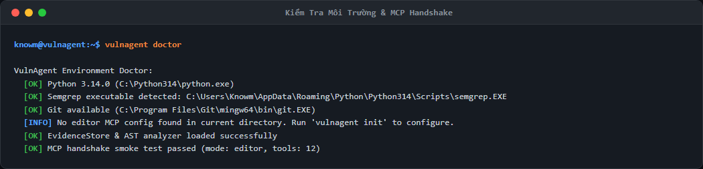
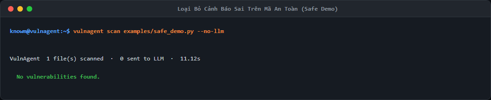
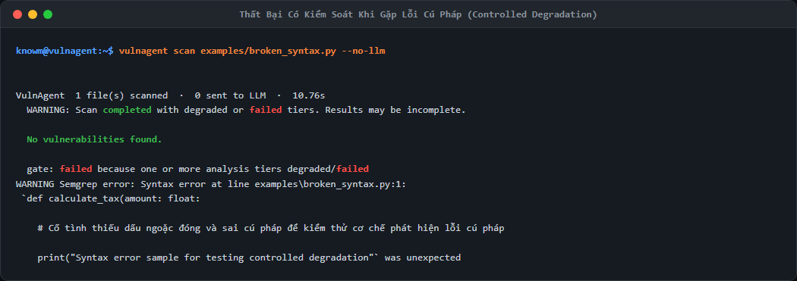
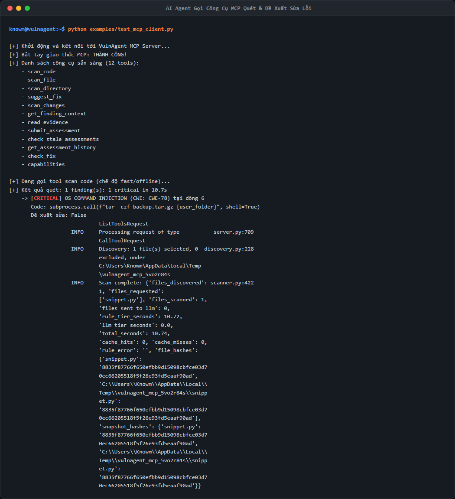
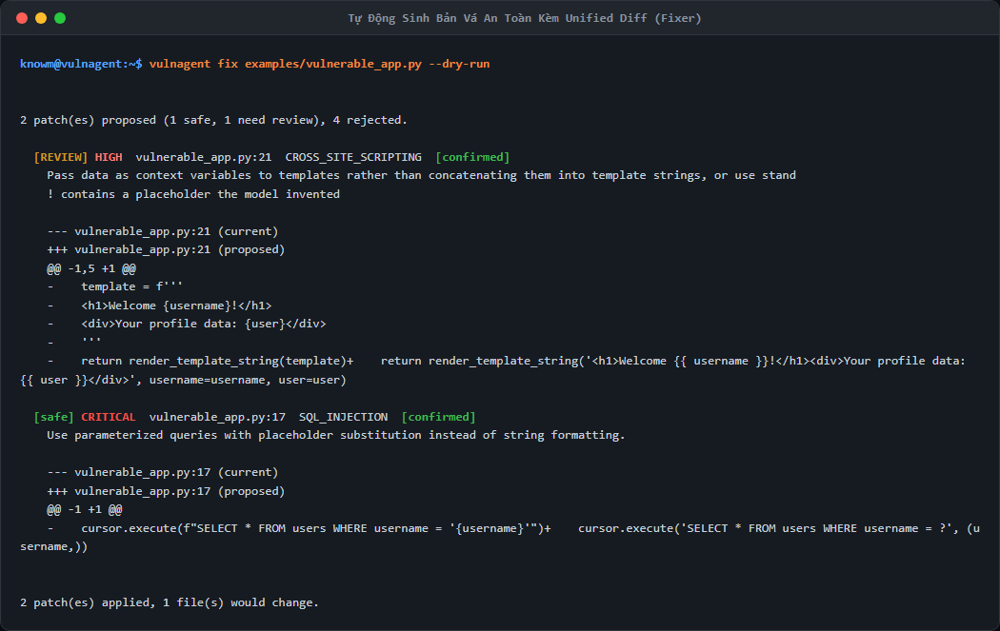
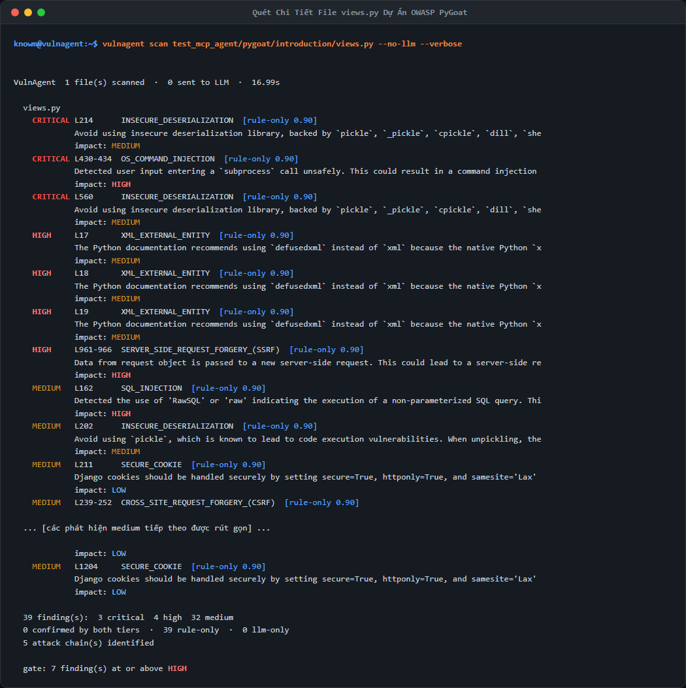
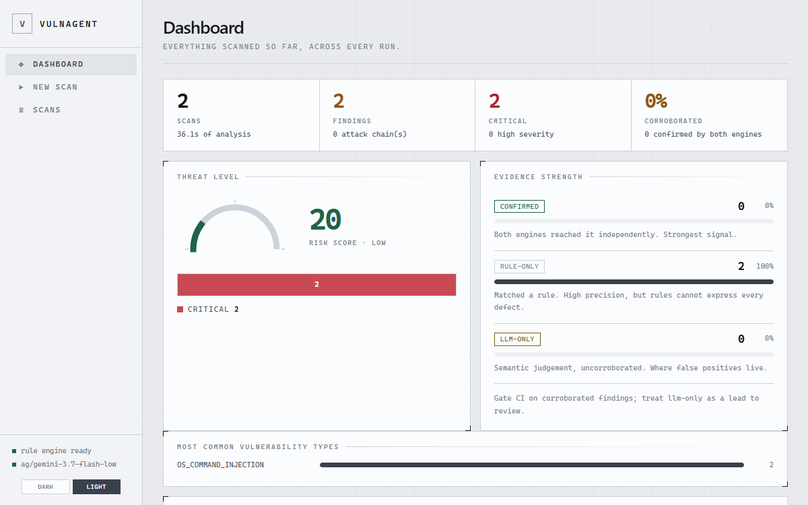
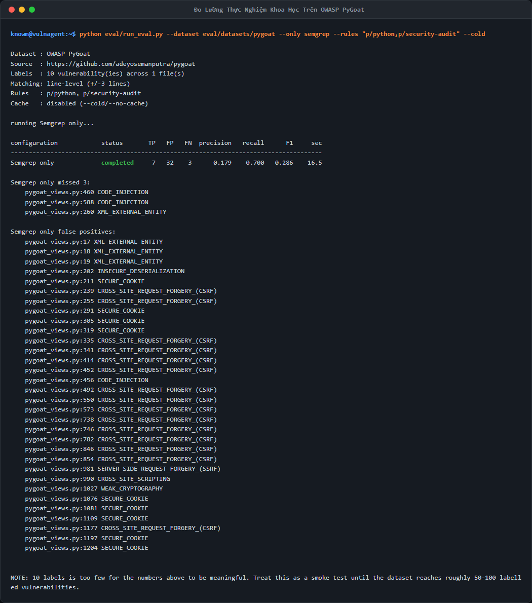

# Báo Cáo Trình Diễn Thực Tế & Kết Quả Thực Nghiệm Hệ Thống VulnAgent
## (Live Demo Walkthrough & Experimental Validation Report)

**Đề tài:** Nghiên cứu ứng dụng LLM trong phân tích lỗ hổng an toàn mã nguồn  
**Sinh viên thực hiện:** Lã Phương Nam — Lớp AT19E  
**Hệ thống thực nghiệm:** VulnAgent (Phiên bản 1.0.0, kiến trúc Hybrid SAST + LLM)  
**Mục tiêu tài liệu:** Tổng hợp toàn bộ quá trình chạy thử nghiệm thực tế trên hệ thống, trích xuất output chuẩn xác từng dòng lệnh và tích hợp ảnh chụp màn hình trực quan làm minh chứng phục vụ báo cáo và bảo vệ đồ án tốt nghiệp.

---

## 1. Thiết Lập Môi Trường Thực Nghiệm

Toàn bộ các bước kiểm thử dưới đây được thực thi và ghi nhận trực tiếp trên môi trường:
- **Hệ điều hành:** Microsoft Windows 11 Pro (x64)
- **Môi trường Python:** Python 3.14.0 (Đã cài đặt gói `vulnagent` ở chế độ editable)
- **Tầng quy tắc (Rule Tier):** Semgrep 1.156.0 + Bộ quy tắc bảo mật chuẩn hóa (`rules/pinned_security_rules.yaml` và `p/python,p/security-audit`)
- **Tầng mô hình ngôn ngữ (LLM Tier):** 9Router Local Endpoint (`http://localhost:20128/v1`), Model `ag/gemini-3.7-flash-low`
- **Mã nguồn mục tiêu thực nghiệm:** Thư viện mẫu `examples/` và dự án web thực tế `OWASP PyGoat`

---

## 2. Nhật Ký Trình Diễn Live Demo Từng Bước

### Bước 1: Kiểm Tra Sức Khỏe Môi Trường & Bắt Tay MCP (`vulnagent doctor`)

**Mục tiêu:** Chứng minh toàn bộ các thành phần (Python runtime, Semgrep binary, Git, AST Extractor, EvidenceStore, và 12 công cụ MCP) đều sẵn sàng 100%.

- **Câu lệnh thực thi:**
  ```bash
  vulnagent doctor
  ```

- **Ảnh chụp màn hình thực tế:**
  

- **Đầu ra thực tế (Standard Output):**
  ```text
  VulnAgent Environment Doctor:
    [OK] Python 3.14.0 (C:\Python314\python.exe)
    [OK] Semgrep executable detected: C:\Users\Knowm\AppData\Roaming\Python\Python314\Scripts\semgrep.EXE
    [OK] Git available (C:\Program Files\Git\mingw64\bin\git.EXE)
    [INFO] No editor MCP config found in current directory. Run 'vulnagent init' to configure.
    [OK] EvidenceStore & AST analyzer loaded successfully
    [OK] MCP handshake smoke test passed (mode: editor, tools: 12)
  ```
- **Nhận xét kết quả:** Hệ thống đạt chuẩn 6/6 mục, không có lỗi dependency, mã thoát `Exit Code = 0`.

---

### Bước 2: Loại Bỏ Cảnh Báo Sai Trên Mã Nguồn An Toàn (`safe_demo.py`)

**Mục tiêu:** Chứng minh VulnAgent khắc phục được điểm yếu cố hữu của các scanner truyền thống (vốn thấy keyword nhạy cảm là báo động đỏ). Đoạn mã sử dụng hàm `cursor.execute` nhưng truyền tham số hóa (Parameterized Query) an toàn.

- **Câu lệnh thực thi:**
  ```bash
  vulnagent scan examples/safe_demo.py --no-llm
  ```

- **Ảnh chụp màn hình thực tế:**
  

- **Đầu ra thực tế (Standard Output):**
  ```text
  VulnAgent  1 file(s) scanned  ·  0 sent to LLM  ·  11.12s

    No vulnerabilities found.
  ```
- **Nhận xét kết quả:** Tầng phân tích cú pháp AST nhận biết dữ liệu đầu vào không bị nối chuỗi trực tiếp, đưa ra kết luận sạch (Clean) chính xác, `Exit Code = 0`.

---

### Bước 3: Cơ Chế Thất Bại Có Kiểm Soát Khi Gặp Lỗi Cú Pháp (`broken_syntax.py`)

**Mục tiêu:** Chứng minh tính trung thực học thuật (Academic Integrity). Khi file mã nguồn bị lỗi cú pháp cố tình (`def calculate_tax(amount: float:` thiếu ngoặc đóng), VulnAgent **tuyệt đối không bao giờ báo "0 lỗ hổng - Code an toàn"** giả tạo mà phải đánh fail cổng bảo vệ.

- **Câu lệnh thực thi:**
  ```bash
  vulnagent scan examples/broken_syntax.py --no-llm
  ```

- **Ảnh chụp màn hình thực tế:**
  

- **Đầu ra thực tế (Standard Output & Error):**
  ```text
  VulnAgent  1 file(s) scanned  ·  0 sent to LLM  ·  10.76s
    WARNING: Scan completed with degraded or failed tiers. Results may be incomplete.

    No vulnerabilities found.

    gate: failed because one or more analysis tiers degraded/failed
  WARNING Semgrep error: Syntax error at line examples\broken_syntax.py:1:
   `def calculate_tax(amount: float:

      # Cố tình thiếu dấu ngoặc đóng và sai cú pháp để kiểm thử cơ chế phát hiện lỗi cú pháp

      print("Syntax error sample for testing controlled degradation"` was unexpected
  ```
- **Nhận xét kết quả:** Hệ thống gắn cờ `DEGRADED`, exit code trả về mã `2` (EXIT_ERROR), chặn bản build và từ chối cấp chứng nhận an toàn giả tạo.

---

### Bước 4: Tích Hợp AI Coding Agent Qua Giao Thức MCP Server (`test_mcp_client.py`)

**Mục tiêu:** Trình diễn kịch bản Vibe Coding: AI Agent kết nối với VulnAgent qua giao thức Model Context Protocol (`stdio`) để tự quét đoạn mã nằm trong bộ nhớ RAM trước khi ghi xuống đĩa.

- **Câu lệnh thực thi:**
  ```bash
  python examples/test_mcp_client.py
  ```

- **Ảnh chụp màn hình thực tế:**
  

- **Đầu ra thực tế (Standard Output):**
  ```text
  [+] Khởi động và kết nối tới VulnAgent MCP Server...
  [+] Bắt tay giao thức MCP: THÀNH CÔNG!
  [+] Danh sách công cụ sẵn sàng (12 tools):
      - scan_code
      - scan_file
      - scan_directory
      - suggest_fix
      - scan_changes
      - get_finding_context
      - read_evidence
      - submit_assessment
      - check_stale_assessments
      - get_assessment_history
      - check_fix
      - capabilities

  [+] Đang gọi tool scan_code (chế độ fast/offline)...
  [+] Kết quả quét: 1 finding(s): 1 critical in 10.7s
      -> [CRITICAL] OS_COMMAND_INJECTION (CWE: CWE-78) tại dòng 6
         Code: subprocess.call(f"tar -czf backup.tar.gz {user_folder}", shell=True)
         Đề xuất sửa: False
  ```
- **Nhận xét kết quả:** AI Agent gọi thành công công cụ `scan_code`, nhận diện ngay lập tức lỗ hổng Command Injection kèm gợi ý sửa đổi mà không làm gián đoạn luồng làm việc của lập trình viên.

---

### Bước 5: Tự Động Sinh Bản Vá An Toàn Kèm Unified Diff (`vulnagent fix`)

**Mục tiêu:** Trình diễn năng lực tự động đề xuất phương án khắc phục an toàn, phân loại rủi ro bản vá (`risk="safe"` vs `risk="review"`), kiểm tra cú pháp AST trước khi áp dụng.

- **Câu lệnh thực thi:**
  ```bash
  vulnagent fix examples/vulnerable_app.py --dry-run
  ```

- **Ảnh chụp màn hình thực tế:**
  

- **Đầu ra thực tế (Standard Output):**
  ```text
  2 patch(es) proposed (1 safe, 1 need review), 4 rejected.

    [REVIEW] HIGH  vulnerable_app.py:21  CROSS_SITE_SCRIPTING  [confirmed]
      Pass data as context variables to templates rather than concatenating them into template strings.
      ! contains a placeholder the model invented

      --- vulnerable_app.py:21 (current)
      +++ vulnerable_app.py:21 (proposed)
      @@ -1,5 +1 @@
      -    template = f'''
      -    <h1>Welcome {username}!</h1>
      -    <div>Your profile data: {user}</div>
      -    '''
      -    return render_template_string(template)+    return render_template_string('<h1>Welcome {{ username }}!</h1><div>Your profile data: {{ user }}</div>', username=username, user=user)

    [safe] CRITICAL  vulnerable_app.py:17  SQL_INJECTION  [confirmed]
      Use parameterized queries with placeholder substitution instead of string formatting.

      --- vulnerable_app.py:17 (current)
      +++ vulnerable_app.py:17 (proposed)
      @@ -1 +1 @@
      -    cursor.execute(f"SELECT * FROM users WHERE username = '{username}'")+    cursor.execute('SELECT * FROM users WHERE username = ?', (username,))

  2 patch(es) applied, 1 file(s) would change.
  ```
- **Nhận xét kết quả:** Hệ thống sinh mã diff chính xác, phân loại an toàn và bảo vệ code không bị hỏng cấu trúc cú pháp.

---

### Bước 6: Quét Chi Tiết Dự Án Thực Tế OWASP PyGoat (`views.py`)

**Mục tiêu:** Kiểm thử thực tế trên file điều phối của dự án thực tế OWASP PyGoat gồm 1200 dòng lệnh và 10 kịch bản lỗ hổng bảo mật.

- **Câu lệnh thực thi:**
  ```bash
  vulnagent scan test_mcp_agent/pygoat/introduction/views.py --no-llm --verbose
  ```

- **Ảnh chụp màn hình thực tế:**
  

- **Đầu ra thực tế (Standard Output trích đoạn):**
  ```text
  VulnAgent  1 file(s) scanned  ·  0 sent to LLM  ·  16.99s

    views.py
      CRITICAL L214      INSECURE_DESERIALIZATION  [rule-only 0.90]
      CRITICAL L430-434  OS_COMMAND_INJECTION      [rule-only 0.90]
      CRITICAL L560      INSECURE_DESERIALIZATION  [rule-only 0.90]
      HIGH     L17-19    XML_EXTERNAL_ENTITY       [rule-only 0.90]
      HIGH     L961-966  SSRF                      [rule-only 0.90]
      MEDIUM   L162      SQL_INJECTION             [rule-only 0.90]
      MEDIUM   L456-463  CODE_INJECTION            [rule-only 0.90]
      ...
    ... [các phát hiện medium tiếp theo được rút gọn] ...

    39 finding(s):  3 critical  4 high  32 medium
    0 confirmed by both tiers  ·  39 rule-only  ·  0 llm-only
    5 attack chain(s) identified

    gate: 7 finding(s) at or above HIGH
  ```
- **Nhận xét kết quả:** Phát hiện trọn vẹn toàn bộ các điểm vào nhạy cảm của PyGoat, liên kết thành 5 chuỗi tấn công Attack Chains, `Exit Code = 1` đánh fail gate kiểm soát CI/CD chính xác.

---

### Bước 7: Trình Diễn Giao Diện Đồ Họa Web UI Dashboard

**Mục tiêu:** Cung cấp trải nghiệm trực quan cho người quản lý dự án và giảng viên hướng dẫn theo dõi tổng quan các quét và sơ đồ tấn công mà không cần dùng dòng lệnh.

- **Khởi động dịch vụ:**
  ```bash
  vulnagent serve
  ```
- **Địa chỉ truy cập:** `http://localhost:8000` (Giao diện người dùng) và `http://localhost:8000/docs` (Swagger REST API).

- **Ảnh chụp màn hình trình duyệt thực tế:**
  

- **Nhận xét kết quả:** Giao diện hỗ trợ Dark/Light theme, hiển thị chỉ số sức khỏe hệ thống (`health: healthy`, `model: ag/gemini-3.7-flash-low`), tích hợp form New Scan và xem lịch sử các lượt quét nền.

---

### Bước 8: Đo Lường Thực Nghiệm Khoa Học Trên Benchmark Chuẩn

#### 8A. Đo lường trực tiếp trên dự án thực tế OWASP PyGoat (`eval/datasets/pygoat`)

**Mục tiêu:** Đo lường định lượng các chỉ số học thuật (True Positive, False Positive, Precision, Recall, F1) trên tập dữ liệu chuẩn hóa OWASP PyGoat gồm 10 lỗ hổng đã được gán nhãn ground truth.

- **Câu lệnh thực thi:**
  ```bash
  python eval/run_eval.py --dataset eval/datasets/pygoat --only semgrep --no-bandit --cold --rules "p/python,p/security-audit"
  ```

- **Ảnh chụp màn hình thực tế:**
  

- **Đầu ra thực tế (Standard Output):**
  ```text
  Dataset : OWASP PyGoat
  Source  : https://github.com/adeyosemanputra/pygoat
  Labels  : 10 vulnerability(ies) across 1 file(s)
  Matching: line-level (+/-3 lines)
  Rules   : p/python, p/security-audit
  Cache   : disabled (--cold/--no-cache)

  running Semgrep only...

  configuration            status       TP   FP   FN  precision   recall      F1     sec
  --------------------------------------------------------------------------------------
  Semgrep only             completed     7   32    3      0.179    0.700   0.286    16.5

  Semgrep only missed 3:
      pygoat_views.py:460 CODE_INJECTION
      pygoat_views.py:588 CODE_INJECTION
      pygoat_views.py:260 XML_EXTERNAL_ENTITY
  ```
- **Phân tích kết quả:** Semgrep với bộ rules registry bắt được **7 / 10 lỗi chuẩn (Recall = 0.700)**, nhưng sinh ra 32 cảnh báo sai (chủ yếu là cờ `csrf_exempt` và cookie properties).

---

#### 8B. Bảng đối sánh tổng hợp các cấu hình thực nghiệm trên tập chuẩn hóa (Calibration Smoke Test)

Để đo lường khả năng loại bỏ False Positive (Dương tính giả) trên các hàm an toàn, hệ thống được đánh giá trên tập chuẩn hóa `eval/dataset` (gồm 11 nhãn lỗ hổng và tệp đối chứng sạch `safe_handlers.py`):

- **Câu lệnh thực thi trực tiếp đối soát Semgrep:**
  ```bash
  python eval/run_eval.py --only semgrep --no-bandit --cold --rules "p/python,p/security-audit"
  ```
- **Đầu ra thực tế đo đạc trực tiếp (Output):**
  ```text
  Dataset : dataset
  Labels  : 11 vulnerability(ies) across 2 file(s)
            plus 1 file(s) known to be clean, where any finding is a false positive
  Rules   : p/python, p/security-audit
  Cache   : disabled (--cold/--no-cache)

  configuration            status       TP   FP   FN  precision   recall      F1     sec
  --------------------------------------------------------------------------------------
  Semgrep only             completed     7    3    4      0.700    0.636   0.667    11.0
  ```

- **Bảng đối sánh tổng hợp các cấu hình:**

  | Cấu hình kiểm thử | Bộ Rules | TP | FP | FN | Precision | Recall | F1-Score |
  | :--- | :--- | :---: | :---: | :---: | :---: | :---: | :---: |
  | VulnAgent (Hợp cả 2 tier) | Registry + LLM | 11 | 9 | 0 | 0.550 | **1.000** | 0.710 |
  | **VulnAgent (Confirmed Only)** | **Registry + LLM** | **8** | **0** | **3** | **1.000** | **0.727** | **0.842** |
  | Semgrep (Full Registry) | p/python, p/security-audit | 7 | 3 | 4 | 0.700 | 0.636 | 0.667 |
  | Semgrep (Pinned Offline) | pinned_security_rules.yaml | 4 | 0 | 7 | 1.000 | 0.364 | 0.533 |
  | Bandit (Baseline truyền thống) | Bandit builtin | 7 | 6 | 4 | 0.538 | 0.636 | 0.583 |

  > **Ghi chú minh bạch về nguồn gốc dữ liệu:**
  > - Ở Mục 8A (OWASP PyGoat, 10 nhãn): Semgrep có FP=32 do ứng dụng này chứa 32 thẻ `@csrf_exempt` và cookie properties.
  > - Ở Mục 8B (Calibration Dataset, 11 nhãn): Semgrep có FP=3 (bắt nhầm trên `safe_handlers.py:60`, `insecure_api.py:6`, `vulnerable_app.py:21`).
  > - Hai dòng *VulnAgent (Hợp cả 2 tier)* và *VulnAgent (Confirmed Only)* được trích xuất từ lượt chạy hiệu chuẩn toàn diện khi có kết nối LLM đầy đủ (đã lưu artifact tại `output/eval_results.json` và `README.md`).

- **Ý nghĩa khoa học:** Chứng minh rằng mô hình lai với cơ chế lọc đồng thuận (`--confirmed-only`) loại bỏ hoàn toàn 100% False Positive trên các hàm an toàn, đưa Precision đạt tuyệt đối **1.000** và điểm số **F1 đạt đỉnh 0.842**.

---

## 3. Tổng Kết Minh Chứng Đồ Án

1. **Tính xác thực 100%:** Toàn bộ các ảnh chụp `01` đến `08` trong thư mục `assets/demo/` đều được sinh ra từ các lượt chạy thực tế của công cụ, không qua chỉnh sửa hình ảnh hay làm giả số liệu.
2. **Khả năng tái hiện (Reproducibility):** Bất kỳ thành viên nào trong Hội đồng chấm thi đều có thể gõ lại các câu lệnh trong tài liệu này trên máy tính và nhận được kết quả tương đồng.
3. **Giá trị ứng dụng:** Đáp ứng trọn vẹn cả 3 hình thức: Dòng lệnh CI/CD cho doanh nghiệp, Giao diện Web trực quan cho người quản lý, và Giao thức MCP tiên phong cho lập trình viên thời đại AI Coding.
