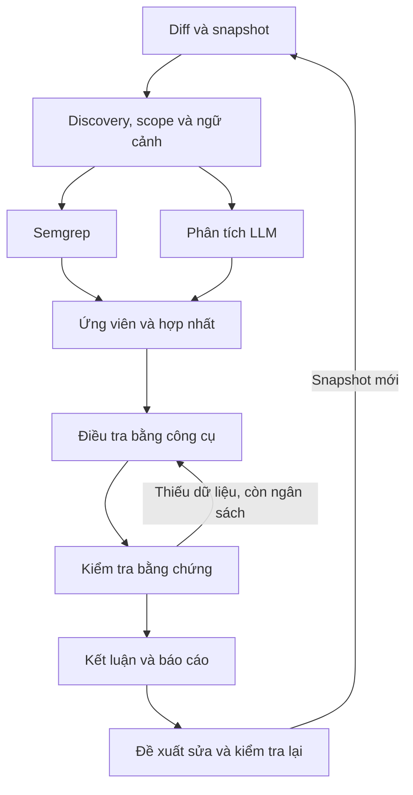

# VulnAgent — Kế hoạch phát triển, ứng dụng và thực nghiệm đồ án

**Sinh viên:** Lã Phương Nam — AT19E  
**Đề tài:** Nghiên cứu ứng dụng LLM trong phân tích lỗ hổng an toàn mã nguồn  
**Phiên bản kế hoạch:** 1.0 — 08/09/2026  
**Mã nguồn đã review:** `nam091/VulnAgent_2`, nhánh `feat/hybrid-scanner-v1`, commit `a06abac77feadce24d9641b5a2f94db256287446`  
**Tài liệu đầu vào:** `DE_CUONG_DO_AN_LA_PHUONG_NAM_AT19E.docx` và toàn bộ trao đổi về review code, ứng dụng cho vibe coder, lựa chọn nhà cung cấp AI.

> Đây là kế hoạch triển khai, không phải báo cáo xác nhận đã sửa phần mềm. Các tên module, lệnh, schema và công cụ mới dưới đây là thiết kế đề xuất, trừ khi ghi rõ đã có. Thời gian và chỉ tiêu là ước lượng để lập kế hoạch; không phải kết quả đo. Review được neo vào commit nêu trên, không khẳng định nhánh hiện tại vẫn giữ nguyên.

## Mục lục

1. [Quyết định định hướng](#s01)
2. [Hiện trạng và đính chính các nhận xét trước](#s02)
3. [Phạm vi và tiêu chí thành công](#s03)
4. [Kiến trúc đích và hai chế độ AI](#s04)
5. [Mô hình dữ liệu và hợp đồng bằng chứng](#s05)
6. [Backlog sửa độ tin cậy và an toàn công cụ](#s06)
7. [Backlog phân tích, fusion và agent](#s07)
8. [Backlog MCP, hooks và trải nghiệm vibe coder](#s08)
9. [Backlog sửa lỗi, hiệu năng và vận hành](#s09)
10. [Thiết kế thực nghiệm](#s10)
11. [Cập nhật đề cương và báo cáo](#s11)
12. [Lộ trình triển khai, PR và mốc nghiệm thu](#s12)
13. [Kịch bản demo và kiểm thử nghiệm thu](#s13)
14. [Rủi ro, giới hạn và các việc hoãn](#s14)
15. [Checklist bắt đầu và checklist bàn giao](#s15)
16. [Bảng truy vết toàn bộ đề xuất](#s16)
17. [Nguồn tham khảo](#s17)

<a id="s01"></a>
## 1. Quyết định định hướng

### 1.1. Định vị sản phẩm

**VulnAgent hỗ trợ kiểm tra và khắc phục lỗi bảo mật trong mã Python do AI thay đổi, tích hợp trực tiếp vào quy trình AI coding.**

Người dùng mục tiêu đầu tiên: sinh viên, indie developer và người làm prototype backend/API Python bằng AI coding assistant, có repository cục bộ và chuẩn bị cho người khác sử dụng sản phẩm. Không nhắm ngay tất cả người dùng công cụ tạo website trên trình duyệt hoặc toàn bộ stack JavaScript.

Lời hứa sản phẩm cần kiểm chứng: người dùng cài một lần, tiếp tục làm việc trong editor, nhận được cảnh báo có bằng chứng và yêu cầu sửa rõ ràng, giảm việc tự đọc báo cáo bảo mật. Không hứa phát hiện mọi lỗ hổng, bảo đảm triển khai an toàn hoặc vượt mọi model lớn.

### 1.2. Đóng góp nghiên cứu

Chọn trọng tâm: **kiểm chứng cảnh báo có bằng chứng, xử lý bất định và kiểm soát việc loại nhầm lỗ hổng thật trong quy trình AI coding**.

Ba câu hỏi nghiên cứu chính:

- **RQ1:** Agent thu thập thêm ngữ cảnh có giảm cảnh báo sai so với hybrid chưa kiểm chứng không, và làm mất bao nhiêu lỗ hổng thật?
- **RQ2:** Ràng buộc bằng chứng, schema và điều kiện bác bỏ có cải thiện độ tin cậy so với agent chỉ làm theo prompt không?
- **RQ3:** Khi đặt trong quy trình AI viết–sửa code, VulnAgent có giảm lỗ hổng còn sót so với AI tự review và AI + Semgrep, với chi phí/thời gian chấp nhận được không?

Câu hỏi phụ: routing, cache và phân tích theo thay đổi ảnh hưởng như thế nào đến chi phí, thời gian và độ phủ? Không mở rộng tất cả câu hỏi phụ nếu tiến độ không cho phép.

### 1.3. Các quyết định đã chốt từ trao đổi

| ID | Quyết định | Hệ quả triển khai |
|---|---|---|
| D01 | Giữ codebase hiện tại, không viết lại từ đầu | Sửa dần theo module, giữ CLI/MCP/API tương thích khi hợp lý |
| D02 | Giữ Semgrep và LLM sinh ứng viên riêng | Phân biệt routing file với lọc findings; không tuyên bố độc lập thống kê |
| D03 | Không coi hai engine cùng báo là xác nhận lỗi | Tách provenance, trạng thái bằng chứng và kết luận |
| D04 | Cho phép kết luận chưa đủ thông tin | Lỗi công cụ, thiếu ngữ cảnh, JSON sai không trở thành an toàn |
| D05 | Editor integration là chế độ mặc định | Không bắt người dùng mua API riêng để thử sản phẩm |
| D06 | API standalone là chế độ tùy chọn | Phục vụ CI, quét theo lô, web độc lập và thực nghiệm có kiểm soát |
| D07 | Agent của editor viết/sửa; VulnAgent hỗ trợ kiểm tra | Tránh hai bên tự sửa chồng chéo |
| D08 | Bằng chứng và kiểm tra sau sửa là điểm nhấn | Giảm ưu tiên dashboard, attack chain và CVSS tự động |
| D09 | Chất lượng phải được đo bằng baseline mạnh | So thêm AI tự review và AI + Semgrep |
| D10 | Giới hạn Python và một editor trong MVP | Mở rộng sau khi luồng đầu tiên đã hoạt động đáng tin |

### 1.4. Cạnh tranh với AI lớn theo cách nào?

Không dựa vào giả định prompt của VulnAgent thông minh hơn model nền tảng. Giá trị có thể xây: phạm vi quét rõ, chính sách dự án, bằng chứng gắn snapshot, trạng thái thất bại minh bạch, đối chiếu trước/sau và số liệu đánh giá. Model mới tốt hơn có thể thay vào lớp điều phối; lõi kiểm tra không phải viết lại.

MCP, hooks và nhiều agent không phải điểm mới nghiên cứu tự thân. Đóng góp phải thể hiện bằng thiết kế cụ thể và hiệu quả được đo. Nếu agent không tốt hơn chỉ thêm Semgrep trong cùng ngân sách, cần thu gọn hoặc thay đổi phương pháp, không lựa số liệu có lợi.

<a id="s02"></a>
## 2. Hiện trạng và đính chính các nhận xét trước

### 2.1. Những phần đã có và nên giữ

- Hai nguồn phát hiện Semgrep và LLM, fusion kết quả.
- Discovery/routing theo rủi ro, giới hạn số file, concurrency và cache.
- Agent gọi công cụ đọc mã, tìm định nghĩa và tìm kiếm; verifier và chain judge.
- CLI, MCP, SARIF, baseline, suppression và GitHub Action.
- Web UI, lịch sử job, tiến độ và kết quả tạm thời.
- Đề xuất bản sửa, diff, kiểm tra cú pháp và quét lại.
- Harness thực nghiệm, bộ mẫu nhỏ và script chuẩn bị dữ liệu bên ngoài.

Đây là tài sản có thể tái sử dụng. Kế hoạch không coi các phần trên là chưa được xây dựng.

### 2.2. Những nhận xét cần hiệu chỉnh

1. Đề cương mô tả Semgrep → LLM phân loại; code review cho thấy Semgrep + LLM phát hiện riêng → fusion → verifier tùy chọn. Cần cập nhật đề cương.
2. Nhận xét trước về giới hạn `Recall_hybrid <= Recall_Semgrep` chỉ đúng với hệ thống chỉ giữ/loại tập cảnh báo Semgrep. Không áp dụng cho hợp của hai bộ phát hiện hiện tại.
3. Đề xuất ban đầu “thêm vòng lặp agent” đã được code hiện tại đáp ứng một phần. Trọng tâm chuyển thành kiểm tra chất lượng công cụ, bằng chứng và quyết định của agent.
4. Code có parser theo dòng và công cụ Python AST, chưa khớp mô tả tree-sitter trong đề cương. Python-only có thể dùng AST; không phải thêm tree-sitter chỉ để khớp một tên công nghệ.
5. Không cần làm lại MCP, diff hay lịch sử quét; cần mở rộng các hợp đồng dữ liệu để dùng được trong luồng editor.

### 2.3. Phân loại bằng chứng review

| Mã | Phát hiện | Mức xác minh trong phiên review |
|---|---|---|
| F01 | Verifier chấp nhận `refuted` với control dạng chuỗi, file không tồn tại và không gọi tool | Tái hiện offline bằng client giả lập |
| F02 | Semgrep lỗi exit code hoặc JSON hỏng trả `[]` | Tái hiện offline bằng giả lập subprocess |
| F03 | `_assemble()` bỏ file không có finding dù LLM thất bại | Kiểm tra logic phương thức trích từ AST với đầu vào giả lập |
| F04 | `_parse()` gặp `evidence_line="L12"` ném ValueError | Tái hiện offline |
| F05 | `CodeTools.search()` đọc qua symlink ra ngoài scan root | Tái hiện với file giả lập, không dùng dữ liệu nhạy cảm |
| F06 | `classify_patch()` không gắn rủi ro cho đổi `return check_password(password)` thành `return True` | Tái hiện offline |
| F07 | Nhãn CWE-611 cho `ElementTree.fromstring` chưa có căn cứ XXE | Đọc mẫu, đối chiếu tài liệu Python, thử external entity nhỏ nhận ParseError |
| F08 | CWE rỗng và một số CWE khác bản chất vẫn được đối sánh đúng | Tái hiện hàm `cwe_matches()` |
| F09 | Fusion dựa vị trí/loại rồi gán 0.95; khả năng ghép nhầm cần test | Đọc mã; chưa đo tỷ lệ ghép nhầm trên corpus |
| F10 | `_verify_fix()` chủ yếu so tổng số findings | Đọc mã; chưa chạy end-to-end sửa thật |
| F11 | Khởi tạo AI client vô điều kiện, cache chưa phản ánh đầy đủ cấu hình | Đọc mã; chưa chạy provider integration |
| F12 | UI thông báo cả hai engine sạch khi trạng thái thực tế có thể khác | Đọc frontend/API; chưa kiểm thử trực quan trong browser |

**Giới hạn review:** chưa chạy full pytest vì thiếu dependency; chưa gọi model thật; chưa đo lại bảng README; chưa xác nhận giao diện trong trình duyệt. Các kiểm tra offline không thay thế integration test hoặc benchmark.

<a id="s03"></a>
## 3. Phạm vi và tiêu chí thành công

### 3.1. MVP

- Ngôn ngữ Python; một framework trước, ưu tiên Flask nếu tận dụng mẫu hiện có.
- Ba nhóm lỗi ban đầu: SQL Injection, Path Traversal, OS Command Injection. Chốt sau khi kiểm tra luật và dữ liệu; ghi rõ thay đổi nếu chọn XSS thay thế.
- Một host đầu tiên: Claude Code nếu có gói phù hợp để kiểm thử; nếu môi trường làm việc thực tế là Cursor thì ưu tiên Cursor. Lõi không phụ thuộc host.
- Editor mode không gọi API từ backend; standalone API mode dùng cho thí nghiệm.
- Kiểm tra theo thay đổi, có ngữ cảnh hàm và phụ thuộc liên quan trong phạm vi hữu hạn.
- Kết luận có bằng chứng; lưu cả findings bị bác bỏ.
- Quét lại sau sửa; một số mẫu test hành vi đã được kiểm tra cho demo.
- Không tự chứng nhận sản phẩm an toàn để phát hành.

### 3.2. Các ngưỡng triển khai đề xuất

Các con số sau là mục tiêu ban đầu, cần điều chỉnh bằng số đo tuần đầu và khóa trước thí nghiệm chính.

| Tiêu chí | Mục tiêu ban đầu | Cách nghiệm thu |
|---|---|---|
| Cài đặt lần đầu | Một lệnh setup; không API key cho editor/rule-only | Thử trên môi trường sạch, ghi bước thủ công còn lại |
| Lỗi bị che thành sạch | Không xảy ra trong bộ fault-injection đã định nghĩa | Tests cho exit code, JSON, timeout, missing engine, partial failure |
| Bác bỏ không bằng chứng hợp lệ | Không xảy ra trong bộ kiểm thử | Không chấp nhận evidence giả, stale hoặc chưa được đọc |
| Lượt rule-only lặp lại | Mục tiêu khoảng 15 giây hoặc thấp hơn trên project demo đã định nghĩa | Báo cold/warm, phần cứng và số file; không tuyên bố cho mọi repo |
| Deep review tương tác | Ngân sách đề xuất 60–120 giây/lượt nhỏ | Timeout trả incomplete, không trả clean |
| Vòng sửa tự động được điều phối | Tối đa 2 vòng mỗi thay đổi, có chống lặp | Test no-progress và snapshot không đổi |
| Tác vụ người dùng | Người mới cài và hoàn tất một lượt kiểm tra không phải đọc báo cáo chuyên gia | Pilot định tính, ghi lỗi cài đặt và số lần cần hướng dẫn |

Không đặt trước “precision phải đạt 95%” để rồi chỉnh tập test theo mục tiêu. Chốt ngân sách loại nhầm lỗ hổng thật trên tập phát triển; đo và báo cáo trên tập test. Không quan sát lỗi trong một tập nhỏ không có nghĩa rủi ro bằng 0.

<a id="s04"></a>
## 4. Kiến trúc đích và hai chế độ AI

### 4.1. Lõi dùng chung



LLM có thể do host editor điều phối hoặc API runner điều phối. Semgrep vẫn chạy được khi hoàn toàn không có LLM. Kiểm tra bằng chứng là thành phần bằng mã xác định; không gọi một model khác rồi coi đó là chứng minh.

### 4.2. Editor mode — mặc định cho vibe coder

- Người dùng đăng nhập vào ứng dụng AI chính thức của họ.
- Host gọi công cụ MCP của VulnAgent.
- Backend trả ứng viên, ngữ cảnh và bằng chứng; không khởi tạo AI client.
- Skill/rule hướng dẫn host điều tra, gửi assessment và sửa code khi phù hợp.
- Backend kiểm tra schema, evidence và trạng thái snapshot trước khi lưu kết luận.
- Hook kích hoạt rule scan hoặc đánh dấu dirty sau đợt sửa; không buộc model chạy sau mỗi phím bấm.

**Thanh toán:** không cần API key riêng cho VulnAgent trong chế độ này; suy luận vẫn dùng hạn mức của host. Không quảng cáo “miễn phí”, “không tốn token” hoặc “không giới hạn”. Nếu MCP tool bên trong vẫn gọi API như chế độ deep hiện tại thì chưa đạt kiến trúc này.

MCP không mặc nhiên cho backend quyền gọi ngược model bằng subscription. Không phụ thuộc vào tính năng sampling hoặc headless chưa xác minh trên host. Không lấy cookie/token subscription làm API proxy. Khi tích hợp phải kiểm tra tài liệu và quyền sử dụng hiện hành của host.

### 4.3. Standalone API mode — tùy chọn

- Backend điều phối agent hiện có sau khi sửa các lỗi an toàn và kiểm chứng.
- Người dùng cấu hình API key riêng; phục vụ CI, web độc lập, chạy theo lô và benchmark.
- Khởi tạo provider theo nhu cầu, chỉ khi tính năng đó được chọn.
- Ghi provider, endpoint hợp lệ, model thực tế, cấu hình sampling, fallback và usage.
- Fallback chỉ thực hiện theo policy rõ; kết quả fallback không được ghi như model chính.
- Báo ngân sách trước khi chạy; dừng có trạng thái rõ khi hết budget.

Không tự động chuyển editor mode sang API có phí khi host hết hạn mức. Rule-only vẫn có thể chạy; phần semantic đánh dấu chưa hoàn tất.

### 4.4. Ranh giới module đề xuất

| Thành phần | Trách nhiệm | Không nên làm |
|---|---|---|
| Core scanner | Scope, snapshot, Semgrep, chuẩn hóa findings | Khởi tạo model vô điều kiện |
| Context/evidence service | Đọc an toàn, cấp evidence ID, kiểm tra snapshot | Suy đoán validity ngữ nghĩa chỉ từ vị trí dòng |
| Assessment policy | Schema, điều kiện nhận kết luận, trạng thái | Coi câu chữ của model là proof |
| Editor adapter | MCP, hướng dẫn host, hooks | Dùng subscription như API backend |
| API runner | Vòng lặp model, budget, retries, usage | Đổi provider âm thầm |
| Reporters/UI | Trình bày findings, coverage, lịch sử | Biến incomplete thành clean |
| Fix verifier | Đối chiếu trước/sau, tests và regression | Chỉ so số lượng cảnh báo |

### 4.5. Cây thư mục mục tiêu tham khảo

Không cần tạo tất cả ngay; tách module khi thực sự triển khai.

```text
src/
  analyzer/       # scanner, discovery, fusion, semgrep, baseline, fixer
  models/         # scan, finding, assessment, evidence, provider usage
  evidence/       # snapshot store, safe reader, evidence validator
  context/        # Python AST index, changed scope, dependency lookup
  agent/          # API loop, verifier, optional chain judge
  integrations/   # adapter host, init/doctor, hook handling
  reporters/      # console, SARIF, JSON
  mcp_server.py
  cli.py
  main.py
  web/
tests/
  unit/
  integration/
  fixtures/
eval/
  manifests/
  adapters/
  datasets/
  results/
docs/
  architecture.md
  evaluation_protocol.md
  limitations.md
```

<a id="s05"></a>
## 5. Mô hình dữ liệu và hợp đồng bằng chứng

### 5.1. Tách trạng thái quét khỏi findings

Mỗi file có record dù không có cảnh báo. Mỗi engine có `requested`, `status`, `reason`, thời gian và phạm vi. Phân biệt `completed`, `failed`, `skipped`, `not_requested`; trạng thái tổng có thể là `completed`, `partial`, `failed`.

`completed` chỉ nói engine đã hoàn tất phần việc được yêu cầu. Nó không chứng minh engine hỗ trợ mọi cú pháp hoặc tìm được mọi lỗi. Ghi rõ giới hạn/parse errors/routing exclusions.

### 5.2. Tách các chiều của finding

- `provenance`: một hoặc nhiều nguồn Semgrep/LLM; tên hiển thị “được cả hai công cụ báo”.
- `assessment.status`: `unreviewed`, `supported`, `refuted`, `uncertain`.
- `evidence_status`: `valid`, `invalid`, `stale`, `missing` — validity cấu trúc/nguồn.
- `severity`: mức tác động cùng giải thích và giả định.
- `ranking_score`: heuristic tùy chọn, không phải xác suất.
- `user_decision`: xác nhận, bỏ qua kèm lý do, cần điều tra; không ghi đè đánh giá máy.
- `lifecycle`: mới, tồn tại, đã xử lý, tái xuất hiện; chỉ xác lập khi các lượt quét so sánh được.

Không trộn `CONFIRMED` do fusion với `confirmed` do verifier. Có thể giữ field cũ trong một phiên bản migration nhưng phải trả thêm schema version và semantics mới.

### 5.3. Snapshot và evidence

Một evidence record tối thiểu gồm:

```json
{
  "evidence_id": "ev_opaque_identifier",
  "snapshot_id": "snapshot_opaque_identifier",
  "path": "app/routes.py",
  "content_hash": "sha256-of-file-content",
  "start_line": 12,
  "end_line": 24,
  "excerpt_hash": "sha256-of-excerpt",
  "origin": "read_lines",
  "read_succeeded": true
}
```

- Evidence ID do backend cấp, model chỉ viện dẫn, không tự tạo ID có quyền.
- Snapshot phải bao gồm nội dung working tree; commit SHA một mình không đủ khi có file chưa commit.
- Kết quả tìm symbol không đồng nghĩa đã đọc thân hàm; giữ loại evidence cụ thể.
- Record nội dung đã trả cho model, kể cả cắt ngắn; không cho viện dẫn phần chưa được cung cấp.
- Khi mã thay đổi, assessment cũ chuyển stale; không lấy dòng cũ làm cơ sở sửa mới.
- Công cụ phải giới hạn phạm vi file, symlink, dung lượng và thời gian tìm kiếm.

### 5.4. Hợp đồng assessment

```json
{
  "finding_id": "finding_identifier",
  "snapshot_id": "snapshot_identifier",
  "status": "uncertain",
  "reason": "Chưa đọc được định nghĩa hàm kiểm tra đường dẫn",
  "evidence_ids": ["ev_opaque_identifier"],
  "missing_context": ["definition of validate_path"],
  "mitigating_control": null,
  "taint_path": [],
  "limitations": ["Chưa phân giải được import động"]
}
```

Điều kiện nhận `refuted`: bằng chứng hợp lệ và liên quan tới control/literal/unreachable path cụ thể; không chỉ có chuỗi `mitigating_control`. Nếu hệ thống chỉ kiểm tra được evidence tồn tại mà chưa kiểm chứng ngữ nghĩa, hiển thị “agent đề xuất bác bỏ” và lưu giới hạn. Với trường hợp rủi ro cao hoặc control không được mô hình hóa, giữ để người dùng rà soát.

Điều kiện nhận `supported`: có bằng chứng theo loại lỗi. Với taint CWE cần source, sink và đường truyền có căn cứ; với hardcoded secret không ép tạo source–sink giả. Scope MVP dùng taint CWE giúp giảm biến thể này.

Điều kiện `uncertain`: thiếu context, lỗi schema, parse lỗi, tool trả lỗi, suy luận mâu thuẫn hoặc không đủ bằng chứng. Hết ngân sách không tự động đồng nghĩa kết luận sai; chỉ nhận kết luận nếu bằng chứng hiện có đạt policy, còn lại uncertain.

### 5.5. Định danh findings

Giữ fingerprint ổn định khi chỉ đổi khoảng trắng/dòng phía trên, nhưng phân biệt hai sink cùng câu lệnh trong cùng file. Bổ sung symbol enclosing, sink/AST anchor và vị trí tương đối khi cần; không chỉ dùng snippet. Đổi fingerprint cần migration baseline, tránh coi toàn bộ finding cũ là mới hoặc suppress nhầm lỗi mới.

<a id="s06"></a>
## 6. Backlog sửa độ tin cậy và an toàn công cụ

**Quy ước:** P0 = làm trước khi dùng kết quả để gate hoặc nghiên cứu; P1 = cần cho MVP ứng dụng; P2 = mở rộng sau MVP. Ước lượng là ngày công tập trung của một người, không cộng máy móc vì một số việc dùng chung nền tảng.

### B01 — Trạng thái engine và file không được mất [P0; 2–3 ngày]

**File:** `src/analyzer/semgrep_runner.py`, `src/analyzer/scanner.py`, `src/models/vulnerability.py`, `src/main.py`, `src/reporters/*`, `src/cli.py`.

**Thực hiện:**

- [ ] Ném lỗi có kiểu khi Semgrep exit code bất thường, JSON sai hoặc response schema không hợp lệ.
- [ ] Phân biệt lỗi toàn engine và lỗi từng file; giữ `errors`/coverage trong output Semgrep.
- [ ] Sửa `_assemble()` tạo trạng thái mọi file kể cả không có findings.
- [ ] Tính `degraded/partial` từ run status, không từ danh sách report có finding.
- [ ] Phân biệt engine missing, disabled và failed.
- [ ] CLI lỗi/incomplete có policy exit rõ; không trả 0 chỉ vì findings rỗng.
- [ ] `--fail-on never` chỉ bỏ gate theo severity, không biến lỗi hạ tầng thành thành công.
- [ ] UI/SARIF/JSON cùng sử dụng một contract trạng thái.

**Nghiệm thu:** timeout, exit=2, invalid JSON, Semgrep thành công nhưng LLM fail, không có file phù hợp, engine không được yêu cầu đều cho trạng thái đúng. UI không nói “cả hai sạch” nếu một bên chưa chạy. Kết quả lỗi không được cache như phân tích hoàn tất.

### B02 — Schema và decision policy của verifier [P0; 2–3 ngày]

**File:** `src/agent/verifier.py`, `src/agent/loop.py`, `src/analyzer/scanner.py`; phụ thuộc model dữ liệu mục 5.

- [ ] Dùng model schema validate mọi field: enum, integer, list, length, null và payload không phải object.
- [ ] Bao phủ parse trong xử lý lỗi; một finding lỗi không làm mất kết quả các finding khác.
- [ ] Không chấp nhận `refuted` chỉ vì `mitigating_control` có ký tự.
- [ ] Yêu cầu evidence hợp lệ theo B03, trường hợp thiếu đưa uncertain.
- [ ] Phân biệt số lần tool được yêu cầu và số lần đọc bằng chứng thành công.
- [ ] Lưu `hit_turn_cap`, `tools_unsupported`, `error`, thời gian và usage nếu có.
- [ ] Không loại khỏi bộ dữ liệu kết quả các finding đã bị bác bỏ; chuyển trạng thái.
- [ ] Kiểm tra `supported` với schema evidence theo CWE; không tin taint path do model tự điền.

**Nghiệm thu:** payload `evidence_line="L12"`, verdict lạ, JSON array, tool fail nhưng tool_calls>0, evidence giả, zero-tool refutation đều được xử lý xác định; không âm thầm xóa cảnh báo. Snapshot test phải dùng dữ liệu giả, không gọi model thật.

### B03 — Evidence store và snapshot [P0/P1; 3–5 ngày]

**Thành phần mới:** snapshot manifest, evidence store, validator. Phụ thuộc B01/B02.

- [ ] Tạo run manifest cho working tree, gồm file hash, commit nếu có, dirty status.
- [ ] Cấp evidence ID sau đọc thành công; lưu path/range/hash/loại tool.
- [ ] Lưu excerpt thực đã cung cấp, không chỉ tool arguments.
- [ ] Validate ID thuộc cùng scan/snapshot; chống sử dụng evidence của repo/run khác.
- [ ] Kiểm tra range tồn tại, hash khớp; mã thay đổi làm assessment stale.
- [ ] Bổ sung các kiểm tra ngữ nghĩa có giới hạn cho một số mẫu MVP; ghi rõ phần còn do model suy luận.
- [ ] Quy định retention và không ghi credential/provider key vào log.

**Nghiệm thu:** viện dẫn sai file, sai dòng, sai snapshot, đoạn chưa đọc, symlink ngoài root, mã đổi sau scan đều không đạt. Viện dẫn đúng không tự nâng thành “đã chứng minh lỗi”.

### B04 — Một đường đọc file an toàn [P0; 1–2 ngày]

**File:** `src/agent/tools.py`, `src/analyzer/discovery.py`, các nơi lấy context.

- [ ] Duyệt file qua policy dùng chung; kiểm tra đường dẫn sau resolve.
- [ ] Reject/skip symlink ngoài root; lựa chọn nhất quán với symlink nội bộ.
- [ ] Áp dụng giới hạn bytes cho cả read, search, find_definition và discovery.
- [ ] Áp dụng giới hạn số file/match/thời gian tìm kiếm.
- [ ] Không dùng regex do model cung cấp không giới hạn thời gian; ưu tiên literal search hoặc engine/policy có giới hạn.
- [ ] Xem code/comment/tool output là dữ liệu không đáng tin; prompt không cho nội dung repo đổi policy.
- [ ] Đọc file cụ thể chỉ trong scope được cấp; không vô tình mở toàn bộ file cấu hình chứa secret.

**Nghiệm thu:** symlink ra ngoài, traversal, file quá lớn, pattern gây xử lý lâu và comment yêu cầu “ignore all previous instructions” không phá phạm vi/policy. Test prompt injection đánh giá hành vi của model riêng, không tuyên bố được giải quyết chỉ bằng system prompt.

### B05 — Rà soát ground truth và matching [P0; 3–5 ngày]

**File:** `eval/dataset/labels.json`, `eval/dataset/samples/*`, `eval/run_eval.py`, `eval/README.md`.

- [ ] Rà từng nhãn bằng tài liệu API, đường dữ liệu và điều kiện khai thác.
- [ ] Sửa hoặc loại khỏi nhóm XXE mẫu `ElementTree.fromstring` nếu không chứng minh external entity resolution trong môi trường đã khóa.
- [ ] Rà nhãn binding `0.0.0.0`; không coi chỉ bind mọi interface là đủ chứng minh một lỗ hổng trong mọi triển khai.
- [ ] Rà file “clean” theo đúng CWE/phạm vi đánh giá; không tuyên bố an toàn toàn diện.
- [ ] CWE thiếu không tự động match ở metric phân loại CWE.
- [ ] Tách exact-CWE và mapped-CWE; mỗi mapping có lý do, không gộp XXE/DoS XML hoặc các lỗi auth khác nhau chỉ vì cùng chủ đề.
- [ ] Đối sánh một-một; xác định chính sách duplicate và location tolerance trước chạy test.
- [ ] Không coi mọi detection không trùng nhãn trong file có lỗi là “sai type”; có thể là lỗi khác chưa gán nhãn, duplicate hoặc sai vị trí.
- [ ] Với partial labels, unmatched là unclassified, không tính precision hoàn chỉnh.
- [ ] Version nhãn, giữ changelog; tính lại README sau thay đổi nhãn.

**Nghiệm thu:** các ca thiếu CWE, hai lỗi sát nhau, cùng CWE khác sink, duplicate, partial ground truth có kết quả kỳ vọng được kiểm tra. Nếu có người rà nhãn thứ hai, ghi bất đồng và cách giải quyết; nếu chỉ một người phải nêu giới hạn.

<a id="s07"></a>
## 7. Backlog phân tích, fusion và agent

### B06 — Tách nguồn phát hiện khỏi xác nhận [P1; 2–3 ngày]

**File:** `src/analyzer/fusion.py`, `src/models/vulnerability.py`, reporters, UI, eval.

- [ ] Đổi semantics `CONFIRMED` do fusion thành corroborated/both-engines.
- [ ] Bỏ diễn giải 0.95/0.90/0.55 là xác suất; giữ ranking heuristic có nhãn nếu còn cần.
- [ ] Dùng canonical path theo root, không chỉ suffix và lowercase trên filesystem phân biệt hoa/thường.
- [ ] Bổ sung sink/AST anchor và enclosing symbol khi ghép findings.
- [ ] Giữ các ứng viên không đủ chắc là cùng lỗi, tránh hợp nhất cưỡng bức.
- [ ] Rà alias quá rộng: command injection/code injection và hardcoded credentials/authentication không luôn cùng lỗi.
- [ ] Lưu liên kết hai finding gốc cùng thông tin engine/rule; không mất provenance.
- [ ] Không nâng độ chắc chắn chỉ vì cùng model đọc lại kết luận cũ.

**Nghiệm thu:** hai SQL sink sát nhau không bị ghép nếu anchor khác; matching không phụ thuộc thứ tự ngẫu nhiên; duplicate nội tier không làm mất lỗi khác. Chạy eval exact matching và kiểm tra ảnh hưởng lên baseline.

### B07 — Ngữ cảnh theo AST và nhu cầu [P1; 3–5 ngày]

**File:** `src/utils/code_parser.py`, `src/agent/tools.py`; thành phần context mới nếu cần.

- [ ] Dùng Python AST để lấy function/class/import, kể cả async def, decorator và nested function.
- [ ] Lấy hàm chứa sink, import và định nghĩa liên quan trước; tránh cửa sổ cố định thiếu control phía trên.
- [ ] Cho agent yêu cầu thêm định nghĩa, caller và config trong scope.
- [ ] Trả rõ symbol không phân giải được, dynamic import và context bị cắt.
- [ ] Giới hạn độ sâu tham chiếu, số file và token; không gửi toàn repo mặc định.
- [ ] Khi thiếu context quan trọng, trả uncertain thay vì suy đoán sanitizer từ tên hàm.
- [ ] Không tuyên bố AST index tương đương static taint analysis liên hàm đầy đủ.

**Nghiệm thu:** helper cùng file, helper khác file, sanitizer đúng/sai, literal data, async handler và import alias có test. Các ca vượt phạm vi trả giới hạn có thể nhìn thấy.

### B08 — Vòng lặp agent hữu hạn [P1; 2–3 ngày]

**File:** `src/agent/loop.py`, verifier, API runner.

- [ ] Ngân sách theo turns, tool calls, thời gian và token khi provider cho phép.
- [ ] Chống gọi lặp cùng tool/arguments/snapshot khi không có bằng chứng mới.
- [ ] Tool error trở thành dữ liệu lỗi có cấu trúc; không tính là đọc thành công.
- [ ] Cắt output theo cấu trúc hợp lệ, không nối chuỗi tạo JSON hỏng.
- [ ] Cancellation có trạng thái và cleanup; thread chạy nền không được giả định đã dừng ngay khi coroutine bị hủy.
- [ ] Provider không hỗ trợ tools: đánh dấu hạn chế; không quảng cáo kết quả single-shot như agent đã điều tra.
- [ ] Retry chỉ lỗi có khả năng phục hồi, có backoff và giới hạn; tránh retry lồng nhau làm nhân chi phí.

**Nghiệm thu:** no-progress, tool unsupported, timeout từng bước, budget exhaustion và response lỗi không treo UI hoặc mất trạng thái toàn scan.

### B09 — Phân tích thay đổi và ảnh hưởng [P1; 4–6 ngày]

**Thành phần:** `scan_changes`, baseline, context service, scanner.

- [ ] Định nghĩa đầu vào: base ref, working tree/index, include untracked, rename/delete và repo chưa có commit.
- [ ] Ghi snapshot trước quét; không quét một bản rồi báo kết quả cho bản khác.
- [ ] Chọn file thay đổi làm điểm bắt đầu, lấy toàn hàm và phụ thuộc liên quan.
- [ ] Khi sửa auth/sanitizer/helper dùng chung, mở rộng caller trong giới hạn.
- [ ] Cache invalidation theo phụ thuộc đã dùng; unresolved dependency phải báo giới hạn.
- [ ] Phân biệt finding mới với lỗi mới: thay đổi context có thể làm một sink cũ trở nên nguy hiểm.
- [ ] Giữ full scan trước phát hành; diff scan không thay thế hoàn toàn full scan.
- [ ] Chỉ ghi “đã xử lý” khi phạm vi liên quan được quét thành công và kết quả so sánh được.

**Nghiệm thu:** sửa một helper làm lỗi ở caller không đổi vẫn được đưa vào scope nếu thuộc khả năng hỗ trợ; đổi dòng không tạo new finding giả; file xóa/rename được xử lý đúng. Các phụ thuộc không phân giải không bị che là clean.

### B10 — Attack chain và CVSS ở mức phù hợp [P2; 1–3 ngày để chỉnh semantics]

- [ ] Giữ chain generation như đề xuất giả thuyết, không mặc định là đường khai thác đã xác nhận.
- [ ] Bằng chứng quan hệ phải cho thấy bước trước cung cấp điều kiện cho bước sau; cùng file hoặc gần dòng không đủ.
- [ ] Dùng cùng evidence policy cho chain judge; model confidence không phải xác suất khai thác đã đo.
- [ ] Trình bày prerequisites, phần suy luận và giới hạn; không làm tâm điểm MVP.
- [ ] Severity và confidence tách biệt.
- [ ] Nếu giữ CVSS, lưu version, vector, giả định môi trường; thiếu dữ liệu thì không sinh điểm chính xác giả.
- [ ] Nên ưu tiên mức nghiêm trọng kèm giải thích trước khi đầu tư CVSS/attack graph.

<a id="s08"></a>
## 8. Backlog MCP, hooks và trải nghiệm vibe coder

### B11 — Tách core khỏi provider [P1; 2–4 ngày]

**File:** `src/utils/ai_client.py`, `src/analyzer/code_analyzer.py`, `src/analyzer/scanner.py`, `src/mcp_server.py`, CLI/API.

- [ ] Core scanner không tạo `AIClient` khi rule-only hoặc editor mode.
- [ ] Đưa provider sau interface/lazy factory; test bằng mock.
- [ ] Tách “sinh ứng viên”, “điều tra”, “nộp assessment” khỏi một hàm deep scan monolithic.
- [ ] Editor mode không gọi bất kỳ API model nào trong backend.
- [ ] API mode truyền cùng schema evidence/assessment vào runner.
- [ ] Giữ CLI flags cũ bằng mapping/deprecation nếu hợp lý; tài liệu hóa thay đổi.
- [ ] `capabilities` trả backend đang bật, engine sẵn có và giới hạn.

**Nghiệm thu:** không có provider key vẫn chạy rule scan/MCP core; integration mock xác nhận zero outbound model request trong editor mode. Bật API mode thiếu key báo hướng dẫn cụ thể, không lỗi lúc khởi động mọi tính năng.

### B12 — Hợp đồng MCP mới [P1; 3–4 ngày; phụ thuộc B03/B09/B11]

| Tool đề xuất | Input chính | Output chính | Quy tắc |
|---|---|---|---|
| `scan_changes` | repo scope đã cấp, base, snapshot options | scan ID, candidates, coverage | Không LLM backend ở editor mode |
| `get_finding_context` | scan ID, finding ID | context và evidence IDs | Ngân sách context, báo truncated |
| `read_evidence` | scan ID, path, range | excerpt, evidence ID | Cùng safe reader B04 |
| `submit_assessment` | finding, snapshot, verdict, evidence | accepted/uncertain/invalid và lý do | ID và policy backend kiểm tra |
| `check_fix` | scan trước, snapshot sau, finding IDs | resolved/persistent/new/incomplete | Không so count đơn thuần |
| `capabilities` | không hoặc session scope | schema version, engines, limits | Không lộ credential |

Giữ `scan_code`, `scan_file`, `scan_directory` cho tương thích; trả schema mới hoặc adapter. Không đưa toàn bộ repo vào một tool response. Không log nguồn nhạy cảm ra stdout của MCP; stdout dành cho protocol.

**Nghiệm thu:** một client mẫu chạy được toàn chuỗi bằng giả lập assessment; request invalid và cross-run evidence bị từ chối có thông báo hiểu được. Phân biệt lưu assessment với quyền sửa file; tool submit không tự cấp quyền ghi mã.

### B13 — Adapter host, skill/rule và hook [P1; 3–5 ngày]

**Host đầu tiên:** chốt theo môi trường thực tế; không triển khai đồng thời nhiều host ở MVP.

- [ ] Kiểm tra schema MCP và hook hiện hành của host trước viết adapter.
- [ ] Cung cấp hướng dẫn cụ thể: scan → đọc context → điều tra → submit → sửa → check_fix.
- [ ] Hook sau đợt sửa đánh dấu dirty/khởi chạy rule scan; debounce các thao tác gần nhau.
- [ ] Chỉ chạy lại khi snapshot thay đổi; lock theo repo để tránh scan trùng.
- [ ] Không chạy vòng LLM mới khi chỉ xem file hoặc không thay đổi code.
- [ ] Stop hook phải nhận biết stop do đâu, chống gọi lại chính nó; không mặc định mọi stop là task completion.
- [ ] Cảnh báo đưa lại vào context host phải ngắn, có ID và next action.
- [ ] Không tự động chặn vì heuristic confidence; ban đầu advisory. Gate chỉ thêm sau khi có số liệu và policy rõ.
- [ ] Tối đa hai vòng sửa–kiểm tra cho một thay đổi; no-progress thì dừng và báo người dùng.
- [ ] Không tắt cơ chế phê duyệt công cụ của host để làm demo có vẻ trơn tru.

**Nghiệm thu:** sửa nhiều file liên tiếp tạo một đợt quét hợp lý; hook không lặp vô hạn; error không treo editor; user biết phần nào chưa kiểm tra. Nếu host không cho feedback tương tác ở hook, dùng hook rule-only và lệnh review rõ ràng thay vì giả định có khả năng đó.

### B14 — Init, doctor và lệnh sử dụng [P1; 2–3 ngày]

**Lệnh mới đề xuất, chưa tồn tại theo review:**

```bash
vulnagent init
vulnagent doctor
vulnagent check --changes
vulnagent check --before-release
```

`init`: phát hiện repo, hỏi/chọn host nếu chưa biết, chuẩn bị cấu hình local scope, kiểm tra Semgrep, chạy mẫu smoke. Không ghi đè cấu hình editor hiện có; merge có backup. Không bắt API key cho editor mode. Nếu CLI global/package installation khác nhau, ghi một đường cài chính và một đường fallback, tránh README có nhiều cách mâu thuẫn.

`doctor`: kiểm tra Python, dependency, Semgrep/rules, MCP startup, quyền đọc scope, schema host và provider chỉ khi API mode được yêu cầu. Hiển thị lỗi có hành động khắc phục.

`check --before-release`: scan rộng theo policy, liệt kê coverage/limitations và findings cần xử lý. Không dùng câu “ready for production” như chứng nhận.

**Nghiệm thu:** cài trên môi trường sạch, chạy rule-only không credential; cấu hình host cũ được giữ; uninstall/reset chỉ bỏ cấu hình VulnAgent do init thêm.

### B15 — UX trong editor và web [P1; 3–5 ngày]

**File:** `src/web/app.js`, `src/main.py`, reporters, jobs.

- [ ] Kết quả đầu: điều có thể xảy ra, file, lý do, trạng thái và next action; CWE chi tiết mở rộng.
- [ ] Bấm bằng chứng mở đúng excerpt/snapshot; taint steps chỉ hiện khi có căn cứ, có nhãn suy luận.
- [ ] Bộ lọc file/CWE/severity/provenance/assessment.
- [ ] Tab giữ lại và tab bác bỏ; người dùng xem lại quyết định của agent.
- [ ] Hiển thị coverage mọi file/engine; bỏ thông điệp clean tĩnh.
- [ ] So sánh hai lần quét; new/existing/resolved chỉ khi scope so sánh được.
- [ ] Kết quả tạm thời phải có nhãn “chưa hoàn tất”; kết quả cuối không xóa dấu vết ứng viên.
- [ ] User decision có lý do, timestamp và scope; suppression không biến thành evidence an toàn.
- [ ] Nội dung code/model được escape; tránh render HTML không tin cậy.
- [ ] Web là nơi xem lịch sử/bằng chứng; không bắt vibe coder upload lại repo sau mỗi sửa.

**Mẫu thông báo đề xuất:**

- “Có dấu hiệu người dùng đọc được file ngoài thư mục tải xuống. Xem 2 đoạn mã liên quan.”
- “Agent đề xuất bác bỏ: đường dẫn đã được chuẩn hóa và kiểm tra containment. Xem bằng chứng.”
- “Chưa xác minh được định nghĩa hàm kiểm tra quyền. Lượt quét chưa đủ để kết luận.”
- “Đã kiểm tra lại bản sửa và test liên quan; phần phân quyền ngoài scope chưa được đánh giá.”

**Nghiệm thu:** test UI với empty/completed/failed/partial/uncertain/stale; kiểm tra trực quan trên màn hình nhỏ và desktop; người dùng đọc được quyết định chính mà không cần hiểu CVSS.

<a id="s09"></a>
## 9. Backlog sửa lỗi, hiệu năng và vận hành

### B16 — Kiểm tra bản sửa theo hành vi [P1; 3–5 ngày]

**File:** `src/analyzer/fixer.py`, `src/cli.py`, API/reporters.

- [ ] Mặc định tạo diff; không đánh dấu safe chỉ vì không thấy placeholder/import/control-flow mới.
- [ ] Đổi `risk=safe` thành thuật ngữ mô tả đúng “qua kiểm tra hình thức” hoặc yêu cầu review.
- [ ] Kiểm tra snapshot trước áp dụng, phạm vi patch và xung đột; không thay thế theo dòng stale.
- [ ] Validate syntax toàn file sau khi phối hợp nhiều patch, không chỉ từng patch riêng lẻ.
- [ ] Kiểm tra lỗi mục tiêu, lỗi mới nghiêm trọng và trạng thái scan hoàn tất; không chỉ `len(after) <= len(before)`.
- [ ] Test hợp lệ vẫn chạy, input không hợp lệ bị từ chối; giữ test bảo mật và chức năng riêng.
- [ ] Không coi test do LLM sinh là ground truth độc lập. Ưu tiên mẫu test đã rà cho ba CWE MVP.
- [ ] Chạy mã/test repo ngoài trong môi trường kiểm thử cô lập, giới hạn tài nguyên, không dùng credential production.
- [ ] Nếu verify thất bại/incomplete, không báo sửa thành công. Chỉ rollback phần tool đã sửa khi snapshot còn đúng; tránh ghi đè thay đổi mới của người dùng.

**Nghiệm thu:** ví dụ `return check_password(...)` → `return True` không được nhận là sửa an toàn; tổng count giảm nhưng xuất hiện lỗi mới vẫn fail gate; scan lỗi sau sửa không coi resolved. Với editor mode, host thực hiện sửa, VulnAgent trả kết quả verify và đề xuất hành động, không âm thầm ghi lại code.

### B17 — Cache và cấu hình provider [P1; 2–3 ngày]

- [ ] Cache key gồm schema/pipeline version, prompt hash, model/provider/endpoint thực tế, cấu hình quyết định đầu ra và hash ngữ cảnh.
- [ ] Context lấy từ dependency thì cache chứa hash dependency; chỉ hash file sink là chưa đủ.
- [ ] Không cache failed, truncated hoặc invalid như completed.
- [ ] Kết quả fallback ghi identity thực; không tái dùng như model chính.
- [ ] Tách cache raw discovery/analysis khỏi assessment theo snapshot và evidence.
- [ ] `--no-cache`, clear cache, cold/warm telemetry; không log key.
- [ ] Ghi file cache atomically, tránh JSON dở khi nhiều job cùng ghi.
- [ ] Quy định scope cache, quyền file và retention nguồn/evidence; không chia sẻ cache cross-user vô tình.

**Nghiệm thu:** đổi prompt/model/endpoint/helper liên quan invalidates kết quả; đổi file không liên quan không nhất thiết mất mọi cache. Cache hit không bị tính là một lần model suy luận độc lập trong thực nghiệm.

### B18 — Hiệu năng, ngân sách và tái lập môi trường [P1; 2–4 ngày]

- [ ] Đo riêng discovery, Semgrep startup/scan, context, model, verification, report.
- [ ] Giữ rule engine chạy một lần mỗi scope phù hợp, không subprocess mỗi snippet trong một lượt lớn.
- [ ] Tránh blocking event loop; review cả fallback provider và tools, không chỉ đường OpenAI chính.
- [ ] Giới hạn concurrency, queue, timeout và số job; cancellation/cleanup rõ.
- [ ] Routing có lý do; khi giới hạn max files, UI không nói tất cả phần còn lại “không có rủi ro”.
- [ ] Ghi token/usage thực nếu provider cung cấp; không suy đoán chi phí chính xác khi host không công khai.
- [ ] Pin dependency và snapshot rules dùng cho thí nghiệm; lưu Python/OS/hardware.
- [ ] Có môi trường dev/test tái lập, kiểm tra dependency thiếu và hướng dẫn cài test extras.

**Nghiệm thu:** scan không làm health endpoint/người dùng khác bị đóng băng; báo p50/p95 theo corpus định nghĩa. Không mở rộng test hiệu năng vô hạn sau khi đã xác định bottleneck và đạt budget đã chọn.

<a id="s10"></a>
## 10. Thiết kế thực nghiệm

### 10.1. Hai nhóm thí nghiệm, không trộn kết quả

**Nhóm A — Chất lượng detector/triage:** mã nguồn cố định, đánh giá ứng viên, fusion, verification và evidence policy.

| Cấu hình | Nội dung | Mục đích |
|---|---|---|
| A0 | Semgrep-only | Baseline truyền thống |
| A1 | LLM-only, ngữ cảnh cố định | Baseline model |
| A2 | Semgrep + LLM, union đã deduplicate | Đánh giá hybrid gốc |
| A3 | Chỉ findings được hai nguồn báo | Trade-off corroboration; không gọi verified |
| A4 | A2 + agent lấy thêm context, policy prompt-only | Đo tác dụng điều tra |
| A5 | A4 + ràng buộc evidence/schema/quyết định | Đo đóng góp chính |
| A6 tùy chọn | Bandit | Baseline bên ngoài, cố định version/config |

Cấu hình A4 mô phỏng phương pháp cũ trong môi trường thí nghiệm, không bật như chế độ mặc định cho người dùng. Bảo đảm không gây hành động thực ngoài phạm vi test.

**Ablation phụ tùy thời gian:** fixed context vs adaptive context; verify LLM-only vs verify toàn bộ ứng viên; routing on/off; cache cold/warm. Không thay nhiều yếu tố rồi quy cải thiện cho một thành phần.

**Nhóm B — Quy trình AI coding:** cùng tác vụ, model/host version và môi trường khởi đầu.

| Cấu hình | Quy trình |
|---|---|
| B0 | AI viết tính năng rồi tự review bảo mật |
| B1 | AI viết/sửa với kết quả Semgrep |
| B2 | AI viết/sửa với VulnAgent và evidence policy |

Đánh giá bằng test chức năng và nhãn/test bảo mật độc lập. Không dùng chính VulnAgent làm trọng tài duy nhất chấm B2. Cấu hình budget ngang nhau là so sánh chính; có thể bổ sung chạy đến hoàn tất và báo tổng chi phí để thấy trade-off thực tế.

### 10.2. Thiết kế dataset

**Giai đoạn phát triển:** 30–50 trường hợp để debug pipeline. **Mục tiêu đánh giá ban đầu:** khoảng 100–200 trường hợp có nhãn và mẫu an toàn, phân bổ theo ba CWE. Đây là mục tiêu khả thi để lập kế hoạch, không phải ngưỡng bảo đảm ý nghĩa thống kê; tăng số lượng không bù được nhãn sai và mẫu gần trùng nhau.

Mỗi trường hợp lưu: ID, project/family, snapshot, CWE, phạm vi nhãn, sink hoặc endpoint, vulnerable/safe/unknown, lý do, điều kiện môi trường, nguồn, người rà và test tái hiện nếu có.

Các nhóm mẫu cần có:

- Lỗi một hàm dễ xác định.
- Dùng API nguy hiểm nhưng dữ liệu literal/an toàn.
- Sanitizer đúng, sai và chỉ có tên gợi an toàn.
- Đường dữ liệu qua helper cùng file và khác file.
- Cặp trước/sau sửa; thêm test giữ chức năng.
- Hai lỗi cùng loại sát nhau để kiểm fusion.
- Thiếu context hoặc import động để kiểm abstention.
- Comment hướng dẫn sai hoặc chứa nhãn để đánh giá leakage/prompt injection.
- Không có ứng viên Semgrep nhưng LLM có thể phát hiện, để đo nhánh ngoài Semgrep.

### 10.3. Nguồn dữ liệu và điều kiện sử dụng

| Nguồn | Vai trò | Điều cần làm trước dùng |
|---|---|---|
| Bộ mẫu hiện có | Smoke/regression | Rà lại nhãn, không dùng 11 nhãn để tuyên bố ưu thế chung |
| OWASP Benchmark for Python | Đánh giá có expected results | Chốt release/commit; kiểm version, CWE, schema nhãn và khả năng scanner |
| SecurityEval | Bổ sung mẫu Python | Mô tả chuyển từ mục đích đánh giá code generation sang detection; kiểm code hoàn chỉnh và nhãn |
| PyGoat | Case study ứng dụng | Gán nhãn theo phạm vi nếu tính metric; nếu chưa đủ nhãn chỉ định tính |
| NIST SARD | Chỉ dùng nếu xác minh suite phù hợp | Ghi suite ID, ngôn ngữ, số mẫu, CWE; không hứa tập Python từ tên SARD chung |
| Cặp mã tự xây có test | Kiểm soát sanitizer/đường dữ liệu | Rà nhãn độc lập nếu được; tránh tất cả mẫu cùng template |

Không coi toàn file vulnerable có nghĩa tất cả cảnh báo trong đó đều đúng. Bộ partial-label không phù hợp để công bố precision toàn diện. Mẫu từ rule tests của engine có thể dùng regression, không dùng làm bằng chứng chính rằng engine vượt đối thủ.

### 10.4. Chia dữ liệu và ngăn rò rỉ

- Chia theo project hoặc họ mẫu, không random từng đoạn gần giống nhau.
- Cặp vulnerable/fixed và biến thể cùng template ở cùng một split.
- Gợi ý tỷ lệ 60/20/20 nếu đủ dữ liệu; dataset nhỏ ưu tiên test holdout có ý nghĩa và mô tả giới hạn.
- Prompt, mapping CWE, threshold và policy chỉ chỉnh trên development/validation.
- Loại nhãn đáp án khỏi đầu vào model: tên file `CWE-...`, comment “this is vulnerable”, metadata ground truth. Giữ mapping tên trung tính sang nhãn bên ngoài.
- Nếu giữ comment nghiệp vụ thật, phân biệt với comment tiết lộ đáp án. Báo tiền xử lý.
- Benchmark công khai có thể đã nằm trong dữ liệu huấn luyện của model; bổ sung mẫu mới, không tuyên bố đã loại được hoàn toàn contamination.
- Chốt manifest và hash trước chạy chính; thay nhãn phải version và chạy lại các cấu hình liên quan.

### 10.5. Đối sánh và đơn vị đo

- Chốt đơn vị: finding tại sink/CWE, testcase, endpoint hoặc file tùy corpus.
- Báo riêng line-level và file-level; không gộp thành một con số recall.
- Một nhãn chỉ match một detection; thêm exact-CWE và mapped-CWE view.
- Với dataset có sink chính xác, dùng tolerance nhỏ đã chốt; nếu AST anchor tốt hơn thì định nghĩa trước thí nghiệm.
- Unmatched trên partial labels = unclassified. Với full labels đã rà, unmatched có thể tính FP theo policy.
- `uncertain` không bị loại khỏi mẫu số để làm đẹp chỉ số.
- Lượt failed/incomplete được báo riêng; không đưa vào “clean”. Nếu phân tích chỉ completed runs thì phải báo tỷ lệ hoàn tất bên cạnh.

### 10.6. Chỉ số bắt buộc

Với tập nhãn đầy đủ và cùng quy tắc matching:

- `Precision = TP / (TP + FP)`.
- `Recall = TP / (TP + FN)`.
- `F1 = 2PR / (P + R)` khi mẫu số xác định.
- `FP removal rate = FP bị bác bỏ / FP trong tập ứng viên ban đầu`.
- `True-vulnerability rejection rate = TP bị bác bỏ nhầm / TP trong tập ứng viên ban đầu`.
- `Uncertain rate = ứng viên uncertain / ứng viên được gửi kiểm chứng`.
- `Decision coverage = ứng viên supported hoặc refuted / ứng viên được gửi kiểm chứng`.
- `Citation validity = evidence được kiểm tra hợp lệ / evidence được viện dẫn`; báo cả tỷ lệ assessment thiếu evidence để tránh cải thiện bằng cách không viện dẫn gì.
- `Completion rate = lượt/phần việc hoàn tất / lượt/phần việc được yêu cầu`.
- Thời gian p50/p95, token, tool calls, cache hit và chi phí khi có dữ liệu.

Mẫu số bằng 0 báo N/A, không tự chuyển thành 100%. “Giảm FP” là tỷ lệ loại cảnh báo sai trong ứng viên; khác false positive rate `FP/(FP+TN)` trên bộ testcase có mẫu âm đầy đủ.

**Quy tắc vận hành chính:** giữ supported + uncertain + unreviewed trong hàng đợi người dùng; refuted chuyển tab riêng. Tính precision/recall trên tập retained này để thấy trade-off thực. Đồng thời báo kết quả trên phần agent tự kết luận và decision coverage; không dùng phần dễ đó đại diện toàn hệ thống.

Ví dụ minh họa, không phải kết quả VulnAgent: ứng viên có 60 TP + 40 FP; agent loại 30 FP và 12 TP. FP removal 75% nhưng true-vulnerability rejection 20%. Không được chỉ công bố con số 75%.

### 10.7. Chỉ số cho AI coding workflow

- Tỷ lệ tác vụ đạt test chức năng.
- Số/tỷ lệ lỗ hổng còn lại theo oracle độc lập.
- Tỷ lệ bản sửa xử lý lỗi mục tiêu mà không phá chức năng.
- Số regression mới.
- Số lần người dùng can thiệp và thời gian xử lý.
- Số vòng sửa, timeout/no-progress, token và thời gian tăng thêm.
- Tỷ lệ cài đặt/kết nối thành công trong pilot.

Có thể pilot 3–5 người để phát hiện lỗi UX, nhưng không dùng mẫu này để tuyên bố hiệu quả đại diện mọi vibe coder. Thu thập nhận xét và số bước cần hỗ trợ, không cần làm nghiên cứu người dùng lớn nếu vượt scope đồ án.

### 10.8. Tái lập và công bằng

- Lưu repo SHA + working tree hash, rules hash, dependency lock, Python/OS/hardware.
- Lưu model ID thực, provider, thời điểm, prompt hash, policy version, budget và fallback.
- Cache off khi đo cold latency/độ biến thiên model. Đo warm cache thành bảng riêng.
- Có thể dùng chung raw candidates đã đóng băng để so hậu xử lý A2–A5; ghi rõ đây không phải các lượt model độc lập.
- Chạy lặp tối thiểu khoảng 3 lần cho subset đại diện nếu ngân sách cho phép; báo mean/range hoặc khoảng tin cậy thích hợp.
- Với confidence interval, dùng resampling theo project/family khi dữ liệu phụ thuộc; không giả định mọi biến thể là độc lập.
- Khi host không công khai model snapshot hoặc token, ghi unknown và hạ mức tuyên bố tái lập; dùng API mode cho thí nghiệm chính cần kiểm soát.
- Không đổi model giữa các cấu hình mà không nêu rõ.

### 10.9. Phân tích lỗi bắt buộc

Mỗi lỗi phân vào: candidate generation miss, routing miss, context thiếu, lỗi parser, fusion nhầm, suy luận sai sanitizer, evidence invalid, bác bỏ sai, mapping nhãn sai, lỗi provider, regression bản sửa. Chọn ít nhất một case thành công và một case thất bại cho mỗi nhóm CWE chính.

**Cổng EVAL:** chỉ công bố bảng kết quả sau khi B01–B05 hoàn tất, nhãn đã chốt và lưu được manifest. Bảng README cũ không đại diện cho code đã sửa nếu chưa chạy lại.

<a id="s11"></a>
## 11. Cập nhật đề cương và báo cáo

### 11.1. Tên và phạm vi

Giữ tên đề tài chính đã được giao. Phần mô tả hướng triển khai có thể viết: “Xây dựng và đánh giá AI agent hỗ trợ kiểm chứng cảnh báo bảo mật mã nguồn Python, tích hợp vào quy trình lập trình có AI hỗ trợ”. Nếu thay phạm vi chính thức, trao đổi người hướng dẫn trước khi chốt bản nộp; kế hoạch này không tự thay đổi đề tài đã duyệt.

### 11.2. Mở đầu

- Trình bày nhu cầu rà soát mã do người/AI tạo trong vòng phát triển.
- Tránh khẳng định mọi người đều viết code bằng AI hoặc phần lớn lỗi đều do một nguyên nhân nếu không có nguồn.
- Diễn đạt cảnh báo sai là vấn đề cần đo trong cấu hình Semgrep/phạm vi đã chọn, không quy kết mọi Semgrep run đều nhiều FP.
- Nêu trade-off precision/recall, bất định và chi phí.
- Nêu đóng góp và giới hạn bằng ngôn ngữ có thể kiểm chứng.

### 11.3. Đề xuất mục lục ba chương

**Chương 1 — Cơ sở và công trình liên quan**

1.1. Lỗ hổng mã nguồn, CWE và ba nhóm lỗi nghiên cứu.  
1.2. Phân tích tĩnh, taint analysis, Semgrep và giới hạn.  
1.3. LLM trong phân tích mã: khả năng, hallucination, context và contamination.  
1.4. Agent có công cụ, MCP/hooks và quy trình AI coding.  
1.5. Công trình liên quan: SeCoRA, IRIS và các baseline phù hợp.  
1.6. Khoảng trống nghiên cứu, RQ và phạm vi.

**Chương 2 — Phương pháp đề xuất**

2.1. Yêu cầu và kiến trúc hai chế độ.  
2.2. Discovery, snapshot, phân tích thay đổi và ngữ cảnh Python.  
2.3. Sinh ứng viên bằng Semgrep/LLM và fusion.  
2.4. Agent điều tra: tools, ngân sách, trạng thái và điều kiện dừng.  
2.5. Evidence contract, kiểm tra trích dẫn và giới hạn ngữ nghĩa.  
2.6. Policy supported/refuted/uncertain và lưu vết.  
2.7. Tích hợp editor: MCP, hooks, phản hồi và kiểm tra lại.  
2.8. Cache, provider, chi phí và giới hạn an toàn công cụ.

**Chương 3 — Cài đặt, thực nghiệm và đánh giá**

3.1. Công nghệ, cấu trúc module và môi trường tái lập.  
3.2. Use case CLI/MCP/editor/web và luồng demo.  
3.3. Dataset, gán nhãn, split và quy tắc matching.  
3.4. Thiết kế thí nghiệm detector/agent và AI coding.  
3.5. Kết quả, trade-off, ablation và chi phí.  
3.6. Case studies, false refutation, failure và regression.  
3.7. Khả năng áp dụng, hạn chế và hướng mở rộng.

Kết luận: trả lời từng RQ bằng số liệu thực, không chỉ liệt kê tính năng đã viết.

### 11.4. Những sửa trực tiếp vào đề cương cũ

| Nội dung cũ | Chỉnh đề xuất |
|---|---|
| Semgrep quét thô → LLM phân loại | Mô tả đúng hai nguồn ứng viên + fusion + verifier; nếu nghiên cứu thêm filter-only thì coi là cấu hình so sánh |
| Chống ảo giác bằng kiểm chứng trích dẫn | Kiểm tra tính hợp lệ của bằng chứng và xử lý kết luận thiếu bằng chứng; nêu giới hạn ngữ nghĩa |
| Tree-sitter | Dùng AST Python nếu đó là implementation; không hứa taint liên hàm đầy đủ |
| CVSS là đầu ra trọng tâm | Severity có lý do trước; CVSS tùy chọn có vector/giả định |
| NIST SARD (Python) | Chỉ cam kết sau khi xác minh suite cụ thể |
| Đo precision/recall/F1 và citation | Thêm false refutation, uncertain, completion, chi phí, chất lượng bản sửa |
| Chỉ so Semgrep thuần | Thêm ablation agent/evidence và AI tự review/AI + Semgrep |
| Tính áp dụng qua giao diện quét repo | Tích hợp editor, kiểm tra thay đổi và sửa–kiểm tra lại |

### 11.5. Tài liệu tham khảo cần sửa

- Tài liệu [5] của đề cương đang dùng URL `1706.03762` cho IRIS. URL đó là **Attention Is All You Need**.
- IRIS tương ứng: **LLM-Assisted Static Analysis for Detecting Security Vulnerabilities**, Ziyang Li, Saikat Dutta, Mayur Naik, arXiv `2405.17238`; kiểm metadata phiên bản xuất bản khi chuẩn hóa trích dẫn.
- SeCoRA là tham khảo triển khai, không phải chứng minh hybrid của đồ án tốt hơn model lớn.
- IRIS đã kết hợp LLM và static analysis; không tuyên bố chỉ việc kết hợp hai công nghệ là mới.
- Khi giữ OWASP Top 10:2021 hoặc CWE Top 25:2023, ghi rõ phiên bản đang dùng. Nếu đổi sang bản mới, rà mapping và tài liệu; không chỉ đổi năm ở danh mục.
- Nguồn web có ngày truy cập; nguồn code có commit; không để tool citation token trong báo cáo.

<a id="s12"></a>
## 12. Lộ trình triển khai, PR và mốc nghiệm thu

### 12.1. Giả định tiến độ

Chưa biết hạn nộp và thời gian làm mỗi tuần. Lịch dưới đây giả định một người làm khoảng 4 ngày công tập trung/tuần, có thể điều chỉnh thành 12–14 tuần. Tổng effort tham khảo khoảng 45–60 ngày công sau khi gộp các việc dùng chung, chưa bao gồm chờ người hướng dẫn hoặc mua quota. Ước lượng từng backlog không phải cam kết; đo velocity sau hai tuần.

Không cần làm nhiều agent lập trình song song để thực hiện kế hoạch. Mỗi đợt chỉ nên tập trung một PR đang hoàn thiện và một việc chuẩn bị dữ liệu/tài liệu có thể làm độc lập.

### 12.2. Timeline đề xuất

| Tuần | Mục tiêu | Backlog chính | Đầu ra/cổng nghiệm thu |
|---|---|---|---|
| 1 | Đóng băng hiện trạng, tái hiện lỗi, thiết kế status/schema | B01, B02 chuẩn bị | Manifest baseline, tests lỗi đã biết, schema v1 |
| 2 | Không mất lỗi, không đọc ngoài scope, parse bền vững | B01, B02, B04 | Gate G1: không có false clean trong fault tests |
| 3 | Evidence store và policy quyết định | B03, B02 hoàn tất | Gate G2: không nhận refutation thiếu evidence hợp lệ |
| 4 | Rà nhãn, matching và provenance | B05, B06 | Dataset v1, matching tests, bỏ semantics confidence giả |
| 5 | Core không API, provider interface | B11, B17 phần cấu hình | Gate G3: editor/rule-only zero backend model calls |
| 6 | Context AST và agent budget | B07, B08 | Helper/async/context tests, vòng lặp hữu hạn |
| 7 | Phân tích thay đổi và MCP contract | B09, B12 | Gate G4: luồng MCP đầu-cuối trên project demo |
| 8 | Một host adapter và init/doctor | B13, B14 | Demo trong editor, không lặp hook, không yêu cầu API riêng |
| 9 | Kiểm tra sau sửa và UX bằng chứng | B16, B15 | Gate G5: demo fix giữ chức năng, lưu cả refuted |
| 10 | Hiệu năng, cache, data holdout và pilot | B17, B18, thí nghiệm pilot | Protocol khóa, budget thực, dataset/test manifest |
| 11 | Chạy thí nghiệm chính | Nhóm A, B trong mục 10 | Raw outputs, metrics, failure logs |
| 12 | Phân tích lỗi và viết báo cáo | Mục 11, sửa docs | Bảng RQ, case studies, báo cáo dự thảo |
| 13–14 dự phòng | Chạy lại do lỗi nhãn/harness, kiểm tra cài đặt và bảo vệ | Gate còn thiếu | Release candidate, demo dự phòng, tài liệu bàn giao |

B05 có thể chuẩn bị ngay từ tuần 1 nhưng chưa dùng làm kết luận trước khi status và nhãn đúng. Phần viết báo cáo bắt đầu từ đầu: ghi nhật ký quyết định mỗi tuần, không chờ tuần 12 mới viết.

### 12.3. Cổng chất lượng

- **G1 — Status:** mọi lỗi kiểm thử đều có trạng thái, không clean giả; no-key rule scan hoạt động sau B11.
- **G2 — Evidence:** không chấp nhận viện dẫn giả/stale/cross-run; kết luận thiếu bằng chứng giữ uncertain.
- **G3 — Modes:** core chạy không provider; editor mode không API backend; API mode cùng schema.
- **G4 — Integration:** host gọi MCP được, hook không vòng lặp; scan đúng snapshot.
- **G5 — Fix:** test chức năng và security cùng chạy; verify partial không coi thành công.
- **G6 — Evaluation:** nhãn/protocol khóa, raw results tái lập, báo cả thất bại và bất định.
- **G7 — Delivery:** README, đề cương, UI và semantics code thống nhất; cài lại từ đầu được.

Nếu gate trước chưa đạt, không dùng gate sau để che thiếu sót. Ví dụ UI đẹp không thay thế status đúng; thêm dataset không sửa nhãn sai.

### 12.4. Kế hoạch chia PR

| PR | Nội dung | Test chính | Phụ thuộc |
|---|---|---|---|
| PR01 | Environment/test extras + baseline manifest | Import/CLI smoke, không gọi model | Không |
| PR02 | Scan status và lỗi Semgrep | Fault injection + output schema | PR01 |
| PR03 | Safe file reader và symlink containment | Synthetic filesystem tests | PR01 |
| PR04 | Verifier schema + lưu uncertain/refuted | Malformed payload, zero evidence | PR02 |
| PR05 | Snapshot/evidence contract | Stale/cross-run/invalid reference | PR03–04 |
| PR06 | Dataset labels + matching protocol | Exact/mapped/missing CWE, duplicates | PR01; metric chính chờ PR02 |
| PR07 | Fusion provenance/anchor + migration | Adjacent sinks, baseline compatibility | PR05–06 |
| PR08 | Lazy provider và modes | No-key/zero outbound editor mode | PR04 |
| PR09 | AST/context + bounded loop | Helper, async, cap, tool errors | PR05/08 |
| PR10 | Changed scope + MCP assessment tools | Working tree, rename, E2E mock | PR07–09 |
| PR11 | Host adapter + init/doctor | Clean install, debounce, no-loop | PR10 |
| PR12 | Fix verification + UI evidence | Regression, incomplete, refuted tab | PR05/10 |
| PR13 | Cache/usage/performance | Prompt/provider/context invalidation | PR09–12 |
| PR14 | Evaluation results + docs | Manifest, metric reproduction | PR06/13 |

Đây là PR đề xuất, không phải lệnh tạo PR hiện tại. Mỗi PR ghi problem → change → resulting behavior → validation → limitations. Không gộp một PR vừa sửa matching benchmark vừa đổi prompt để khó xác định nguyên nhân cải thiện.

### 12.5. Bản rút gọn khi còn 4–6 tuần

Giữ các mục không thể bỏ:

1. B01–B05: trạng thái, bằng chứng, safe reader và nhãn.
2. B11: core không API.
3. B12: MCP trả ứng viên/context và nhận assessment; giảm số tool nếu cần.
4. B13: một host, có thể dùng lệnh review chủ động trước; hook chỉ rule-only nếu không đủ thời gian.
5. B06 tối thiểu: sửa semantics corroborated, không cần matching graph phức tạp.
6. Thí nghiệm A0/A2/A4/A5 và pilot B0/B1/B2 nhỏ nhưng báo rõ giới hạn.

Cắt trước: attack chain nâng cao, CVSS tự động, nhiều provider, nhiều host, auto-fix tổng quát, UI redesign và caller graph sâu. Có thể quét toàn file thay đổi với context hữu hạn thay vì làm interprocedural đầy đủ. Công bố rõ giới hạn, không gọi đó là full cross-file analysis.

<a id="s13"></a>
## 13. Kịch bản demo và kiểm thử nghiệm thu

### 13.1. Demo chính: tải file an toàn trong AI editor

**Chuẩn bị:** một project Python nhỏ có route tải file, hai tài khoản nếu cần ở demo mở rộng, thư mục tải xuống chứa dữ liệu giả. Không dùng hệ thống thật hay credential thật.

**Các bước:**

1. Người dùng yêu cầu AI thêm tải file theo tên.
2. AI sửa code; hook/lệnh review khởi chạy `scan_changes`.
3. VulnAgent trả nghi ngờ Path Traversal cùng evidence location.
4. Host đọc context và định nghĩa helper, nộp assessment.
5. Policy kiểm tra evidence; kết quả supported hoặc uncertain có lý do.
6. Host sửa containment sau canonicalization theo API phù hợp.
7. Chạy test file hợp lệ, file không tồn tại, đường dẫn vượt thư mục và đường dẫn tuyệt đối; thêm symlink case nếu thuộc threat model.
8. `check_fix` quét snapshot mới, báo lỗi mục tiêu và regression.
9. Hiển thị before/after, evidence và limitations; không nói “toàn ứng dụng đã an toàn”.

**Điểm nhấn:** người dùng không mở dashboard khác để copy code; quyết định có thể truy về mã thực; bản sửa vẫn tải file hợp lệ.

### 13.2. Demo giảm cảnh báo sai

Dùng helper tên không gợi ý, thực sự kiểm tra dữ liệu đúng. Agent đọc định nghĩa, viện dẫn control và đề xuất bác bỏ. Tab refuted vẫn giữ ứng viên và evidence. Đổi helper thành bản kiểm tra sai; chạy lại phải invalid cache và thay đổi kết luận hoặc uncertain. Không chỉ đổi tên hàm để tạo khác biệt.

### 13.3. Demo thất bại có kiểm soát

Giả lập provider timeout hoặc định nghĩa helper ngoài scope. Kết quả phải là partial/uncertain và hiển thị thông tin còn thiếu. Đây là bằng chứng hệ thống biết giới hạn, không phải demo “mọi thứ luôn xanh”. Có bộ output lưu sẵn để trình bày nếu mạng lỗi, ghi rõ là lượt ghi trước, không giả làm live.

### 13.4. Ma trận test tối thiểu

| Nhóm | Ca kiểm thử | Kỳ vọng |
|---|---|---|
| Engine | Exit code bất thường/JSON sai/timeout | Failed/partial, không clean |
| Aggregation | LLM fail, Semgrep không có findings | File vẫn có status |
| Provider | Không key, editor mode | Core hoạt động, không outbound model call |
| Evidence | File/dòng giả, ID khác run, code đổi | Invalid/stale, không bác bỏ |
| Verifier | Zero tool, tool error, malformed JSON | Policy đúng, không crash toàn scan |
| Scope | Symlink ngoài root, traversal, file lớn | Không đọc nội dung ngoài quyền |
| Fusion | Hai sink sát nhau, alias khác bản chất | Không gán corroborated sai |
| Baseline | Đổi dòng/rename/context | Không suppress nhầm, lifecycle có căn cứ |
| Context | Async/helper/import động | Phân giải trong phạm vi hoặc báo thiếu |
| Cache | Prompt/model/provider/helper đổi | Invalidate đúng |
| Hook | Nhiều edits/stop lặp/no-change | Debounce, không lặp vô hạn |
| Fix | Bỏ check auth, syntax pass | Không gọi safe chỉ vì parse được |
| Verify fix | Count giảm nhưng regression/partial | Không báo resolved thành công |
| UI | Empty/partial/refuted/stale | Thông điệp đúng, evidence mở được |
| Eval | CWE rỗng/partial labels/duplicate | Mẫu số và matching đúng protocol |

Test unit dùng mock provider. Integration riêng dùng model thật với ngân sách rõ; không để test thường tự tiêu API. Sau khi gate cần thiết đạt, ngừng mở rộng kiểm thử tùy ý và chuyển sang việc tiếp theo.

<a id="s14"></a>
## 14. Rủi ro, giới hạn và các việc hoãn

| Rủi ro | Biện pháp | Phần vẫn còn giới hạn |
|---|---|---|
| Model mạnh hơn khiến prompt đơn giản mất giá trị | Đầu tư evidence, policy, workflow, eval | Không có bảo đảm lợi thế thương mại lâu dài |
| Cùng host viết và tự review lặp sai lầm | Rule engine/test/evidence bổ sung | Không gọi là review độc lập thống kê |
| Hook/API host thay đổi | Adapter nhỏ, capability check, version docs | Cần bảo trì theo host |
| Subscription hết quota | Hiển thị chưa hoàn tất, rule-only tiếp tục | Không tự đổi sang API tính phí |
| Quét theo diff bỏ sót ảnh hưởng xa | Scope expansion và full release scan | Không giải được mọi import/call động |
| Benchmark thiên lệch/đã gặp trong training | Split theo họ mẫu, mẫu mới, limitations | Không chứng minh hết contamination |
| Agent bác bỏ sai | Evidence policy, audit refuted, đo loss TP | Evidence tồn tại chưa chứng minh logic đúng |
| Test sửa do LLM sinh yếu | Oracle/test độc lập, mẫu đã rà | Test pass chưa chứng minh an toàn toàn diện |
| Quá nhiều tính năng | Cổng chất lượng, MVP ba CWE | Nhiều use case sẽ nằm ngoài scope |
| Chi phí/thời gian tăng | Routing, cache, budget và telemetry | Model deep vẫn có độ trễ |

**Hoãn sau MVP:** hỗ trợ nhiều ngôn ngữ; fine-tuning; RAG/vector database lớn; nhiều agent chuyên gia; chatbot bảo mật tổng quát; attack graph toàn repo; tự động sửa toàn bộ project; đăng nhập nhiều tenant; dịch vụ SaaS trả phí; tính điểm production readiness; tích hợp mọi AI editor.

**Ngoại lệ:** nếu dữ liệu thực chứng minh một việc đang hoãn là bottleneck chính, có thể đổi ưu tiên nhưng phải ghi quyết định, lý do và việc nào bị cắt để bù.

<a id="s15"></a>
## 15. Checklist bắt đầu và checklist bàn giao

### 15.1. Bảy buổi làm việc đầu tiên

1. **Buổi 1:** kiểm tra HEAD so với commit review, tạo nhánh sửa riêng, chốt host/framework/CWE/hạn nộp; ghi manifest hiện trạng.
2. **Buổi 2:** tạo môi trường test, bổ sung dependency dev; chuyển các repro offline thành regression tests.
3. **Buổi 3:** sửa Semgrep errors và file status; kiểm tra CLI/API/UI không clean giả.
4. **Buổi 4:** sửa safe file reader và symlink; thêm timeout/giới hạn tìm kiếm cần thiết.
5. **Buổi 5:** sửa parser/verifier, giữ uncertain/refuted; chưa cho bác bỏ thiếu bằng chứng.
6. **Buổi 6:** chốt schema snapshot/evidence; triển khai lát cắt `read_lines` → evidence → assessment.
7. **Buổi 7:** rà nhãn 11 mẫu hiện có, ghi vấn đề XXE/matching và sửa tài liệu claim quá mạnh.

Mỗi buổi có thể kéo dài hơn một phiên học; ưu tiên hoàn tất tiêu chí, không chạy theo lịch bằng cách bỏ test có ý nghĩa.

### 15.2. Definition of Done cho mỗi backlog

- [ ] Có problem statement và ID backlog liên quan.
- [ ] Có thay đổi nhỏ, review được; không sửa nhiều hướng không liên quan.
- [ ] Test chứng minh lỗi cũ và behavior mới khi cần.
- [ ] Không mất status, provenance hoặc evidence trong serializer/report.
- [ ] Tài liệu command/schema được cập nhật.
- [ ] Không claim metrics chưa đo.
- [ ] Không commit API key, dữ liệu riêng hoặc output nhạy cảm.
- [ ] Migration/backward compatibility được ghi nếu đổi schema/fingerprint.

### 15.3. Bộ bàn giao phần mềm

- [ ] README một luồng cài chính, có init/doctor và demo.
- [ ] Editor mode và rule-only không yêu cầu API riêng.
- [ ] Standalone API mode có cấu hình/budget rõ ràng.
- [ ] Dependency/rules lock hoặc manifest đủ tái lập.
- [ ] JSON schema versioned, CLI exit semantics và MCP contract.
- [ ] Unit/integration/fault tests có hướng dẫn chạy.
- [ ] Demo repo dữ liệu giả, test chức năng và bảo mật.
- [ ] Known limitations và cách xem partial/uncertain/refuted.

### 15.4. Bộ bàn giao nghiên cứu

- [ ] RQ và đóng góp khớp implementation.
- [ ] Dataset manifest, labels version, split và provenance.
- [ ] Protocol khóa trước main run.
- [ ] Raw outputs, usage, errors, code tính metrics.
- [ ] Bảng baseline, ablation, cold/warm và workflow.
- [ ] Phân tích false refutation/false negative, không chỉ thành công.
- [ ] Case study và mô tả đe dọa tính hợp lệ.
- [ ] Mục lục và tài liệu tham khảo sửa đúng IRIS/OWASP/dataset.
- [ ] Slide/demo bảo vệ có cả trường hợp chưa kết luận và thất bại có kiểm soát.

<a id="s16"></a>
## 16. Bảng truy vết toàn bộ đề xuất

Bảng này nối các trao đổi trước với công việc cụ thể, gồm cả đề xuất đã được điều chỉnh sau khi đọc code.

| Chủ đề trong trao đổi | Quyết định cuối | Vị trí triển khai |
|---|---|---|
| Giữ Semgrep + LLM | Giữ hybrid, nghiên cứu giá trị bổ sung có đo | D01–D03, mục 10 |
| LLM chỉ lọc Semgrep bị giới hạn recall | Chỉ áp dụng cho cấu hình filter-only, không gán cho union hiện tại | Mục 2.2 |
| Thêm agent lấy context | Agent đã có, sửa chất lượng bằng chứng và tools | B02–B04, B07–B08 |
| Citation đúng chưa đủ chống hallucination | Đổi thuật ngữ, evidence contract và giới hạn ngữ nghĩa | Mục 5, B03, mục 11 |
| Ba trạng thái phân tích | supported/refuted/uncertain, thêm unreviewed và user decision | Mục 5, B02 |
| Không xóa cảnh báo bị bác bỏ | Lưu audit và tab refuted | B02, B15 |
| Semgrep lỗi trả rỗng | Exception/status rõ | B01 |
| LLM fail mất report | Status mọi file độc lập findings | B01 |
| Parser verifier crash | Schema và per-finding failure handling | B02 |
| Symlink/đọc ngoài root | Safe reader chung | B04 |
| Fusion theo dòng và confidence 0.95 | Corroborated, AST anchor, heuristic không xác suất | B06 |
| No-key rule mode | Lazy provider và core không AIClient | B11 |
| Cache thiếu context/provider/prompt | Identity thực, dependency hash, cold/warm | B17 |
| Parse async/tree-sitter | Python AST, sửa tài liệu đúng implementation | B07, mục 11 |
| Auto-fix cú pháp không đủ | Diff mặc định, behavioral verification | B16 |
| Verify chỉ so count | Target/regression/completion checks | B16 |
| CVSS/severity | Tách confidence, CVSS có vector/giả định nếu giữ | B10 |
| Attack chain | Phần mở rộng, giả thuyết cần evidence | B10, mục 14 |
| UI khó dùng | Ngôn ngữ tác động, evidence, filter, compare | B15 |
| Tiến độ/caching/concurrency | Giữ những gì có, đo bottleneck, không viết lại | B18 |
| Vibe coder | Python backend, một host, ngay trong workflow | Mục 1, 3, B13–B15 |
| AI lớn ngày càng tốt | Cạnh tranh bằng workflow/evidence/eval, không claim model hơn | Mục 1.4, 10 |
| MCP không bảo đảm được gọi | Skill/rule + hook có chống lặp | B12–B13 |
| Scan diff | Diff làm seed, mở rộng context/impact | B09 |
| AI sửa–quét lại | Hai vòng giới hạn, test giữ chức năng | B13, B16 |
| Một lệnh cài và kiểm trước release | init/doctor/check; không chứng nhận production | B14 |
| Subscription không mua API riêng | Host điều phối model, backend không gọi LLM | Mục 4.2, B11–B13 |
| API ngoài | Tùy chọn cho CI/web độc lập/eval | Mục 4.3, B17 |
| Subscription không đồng nghĩa miễn phí | Ghi hạn mức, không tự bật API trả phí | Mục 4, 14 |
| Không dùng token subscription làm proxy | Tích hợp chính thức, kiểm tài liệu host | Mục 4.2 |
| Lỗi nhãn XXE và CWE mapping | Rà ground truth, exact/mapped, version nhãn | B05 |
| Dataset quá nhỏ | Mở rộng có kiểm soát, test holdout, không chọn theo kết quả | Mục 10.2–10.4 |
| SARD/SecurityEval/PyGoat/Benchmark | Xác minh suite và vai trò đúng | Mục 10.3 |
| Bảng README chưa đủ chứng minh | Chạy lại sau sửa, lưu raw/manifest | Mục 10.8–10.9 |
| So với AI tự review | Ba cấu hình workflow, oracle độc lập | Mục 10.1, 10.7 |
| Đề cương lệch code | Cập nhật hai nguồn + verifier + editor/API modes | Mục 11 |
| IRIS link sai | Sửa arXiv 2405.17238 | Mục 11.5, nguồn S03 |
| Lộ trình và phạm vi | 12–14 tuần tham khảo, bản rút 4–6 tuần | Mục 12 |

<a id="s17"></a>
## 17. Nguồn tham khảo

Nguồn dưới đây đã được dùng trong trao đổi/review trước khi lập kế hoạch. Ngày lập kế hoạch 08/09/2026. Chính sách subscription, khả năng hooks/MCP và phiên bản dataset có thể thay đổi; kiểm tra lại nguồn chính thức khi bắt đầu adapter/thí nghiệm. Không coi việc có tên trong danh mục là đã triển khai hoặc đã benchmark.

- **S01 — Mã nguồn đã review:** [VulnAgent tại commit a06abac](https://github.com/nam091/VulnAgent_2/tree/a06abac77feadce24d9641b5a2f94db256287446). Các đường dẫn module trong tài liệu được hiểu tương đối với snapshot này.
- **S02 — Dự án tham khảo:** [SeCoRA](https://github.com/shivamsaraswat/secora). README mô tả tính năng và giới hạn; không dùng làm chứng minh hiệu quả của VulnAgent.
- **S03 — IRIS:** [LLM-Assisted Static Analysis for Detecting Security Vulnerabilities](https://arxiv.org/abs/2405.17238). Công trình liên quan về kết hợp LLM và static analysis; không áp kết quả Java của IRIS trực tiếp cho Python của đồ án.
- **S04 — Transformer:** [Attention Is All You Need](https://arxiv.org/abs/1706.03762). URL bị gắn nhầm vào IRIS trong đề cương cũ.
- **S05 — Semgrep:** [Taint analysis overview](https://docs.semgrep.dev/writing-rules/data-flow/taint-mode/overview). Cơ sở source/sink/sanitizer; khóa version và engine khi thực nghiệm.
- **S06 — OWASP Benchmark:** [Trang dự án chính thức](https://owasp.org/www-project-benchmark/). Có phần Python; xác minh release và expected results cụ thể trước nhập dữ liệu.
- **S07 — SecurityEval:** [Repository chính thức](https://github.com/s2e-lab/SecurityEval). Mục đích gốc liên quan đánh giá mã được sinh; cần mô tả chuyển đổi sang đánh giá detector.
- **S08 — NIST SARD:** [Software Assurance Reference Dataset](https://samate.nist.gov/SARD/). Không mặc định có suite Python phù hợp khi chưa xác minh.
- **S09 — XML Python:** [XML security](https://docs.python.org/3/library/xml.html#xml-security). Cơ sở rà nhãn ElementTree/XXE; kiểm thêm parser version của môi trường thực nghiệm.
- **S10 — Cursor MCP:** [Model Context Protocol](https://cursor.com/docs/mcp). Host gọi tools; MCP không tự biến subscription thành backend API.
- **S11 — Cursor hooks:** [Hooks documentation](https://cursor.com/docs/hooks). Adapter phải bám sự kiện và schema hiện hành.
- **S12 — Cursor security integration:** [Hooks for security and platform teams](https://cursor.com/blog/hooks-partners). Cho thấy tích hợp scanner không phải ý tưởng độc quyền; đồ án cần chứng minh đóng góp cụ thể.
- **S13 — Claude Code MCP:** [Connect to MCP servers](https://code.claude.com/docs/en/mcp-quickstart).
- **S14 — Claude Code hooks:** [Hooks reference](https://code.claude.com/docs/en/hooks), [Hooks guide](https://code.claude.com/docs/en/hooks-guide). Stop hook không đồng nghĩa toàn tác vụ đã hoàn thành; cần chống lặp.
- **S15 — Claude Code subscription:** [Use Claude Code with your Pro or Max plan](https://support.claude.com/en/articles/11145838-use-claude-code-with-your-pro-or-max-plan). Phân biệt sử dụng trong gói với API billing; không hứa không phát sinh phí ngoài mọi điều kiện.
- **S16 — Đề cương người dùng:** `DE_CUONG_DO_AN_LA_PHUONG_NAM_AT19E.docx`, đã đọc trong phiên trao đổi. Kế hoạch này không sửa trực tiếp file đề cương gốc.

---

**Quyết định hành động đầu tiên:** bắt đầu B01–B05 để làm kết quả đáng tin; sau đó tách core không API và hoàn thành một luồng MCP trong editor. Chỉ mở rộng tính năng khi baseline, evidence và phép đo đủ rõ để đánh giá lợi ích thực.
